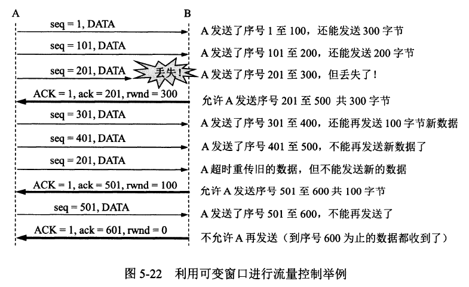
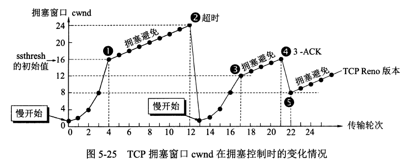
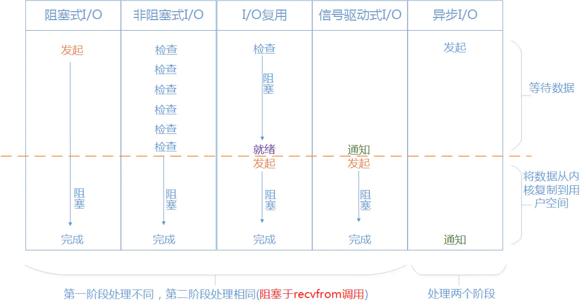

# 计算机网络

### 1. TCP首部格式


- 源端口号（16bit）：表示发送端端口号。
- 目的端口号（16bit）：表示接收端端口号。
- 序号（32bit）：传输方向上字节流的字节编号。初始时序号会被设置一个随机的初始值（ISN），之后每次发送数据时，序号值 = ISN + 数据在整个字节流中的偏移。假设A -> B且ISN = 1024，第一段数据512字节已经到B，则第二段数据发送时序号为1024 + 512。用于解决网络包乱序问题。
- 确认号（32bit）：接收方对发送方TCP报文段的响应，其值是收到的序号值 + 1。是指下一次应该收到的数据的序号，表示已收到确认号前一位为止的数据。
- 首部长（4bit）：标识首部有多少个4字节 * 首部长，最大为15，即60字节。
- 保留（4bit）：为了以后扩展时使用，一般设置为0。
- 标志位（6bit）：
  - CWR：Congestion Window Reduced，ECE标志为1时，则通知对方已将拥塞窗口缩小。
  - ECE：ECN-Echo，置为1会通知通信对方，从对方到这边的网络有拥塞。在收到数据包的IP首部中ECN为1时将TCP首部中的ECE设置为1。
  - URG：标志紧急指针是否有效。该位位1时，表示包中有需要紧急处理的数据。
  - ACK：标志确认号是否有效（确认报文段）。用于解决丢包问题。
  - PSH：提示接收端立即从缓冲读走数据。该位为1时，表示需要将收到的数据立刻传给上层应用协议。
  - RST：表示要求对方重新建立连接（复位报文段）。该位为1时，表示TCP连接中出现异常必须强制断开连接。（程序宕掉、切断电源等原因导致主机重启，所有连接信息将全部被初始化）
  - SYN：表示请求建立一个连接（连接报文段）。SYN为1表示希望建立连接，并在其序号的字段进行序号初始值的设定。
  - FIN：表示关闭连接（断开报文段）。
- 窗口大小（16bit）：接收窗口。用于告知对方（发送方）本方的缓冲还能接收多少字节数据。用于解决流控。
- 校验和（16bit）：接收端用CRC检验整个报文段有无损坏。
- 紧急指针（16bit）：从数据部分的首位到紧急指针所指示的位置为止为紧急数据。
- 选项：用于提高TCP的传输性能。


### 2. UDP首部格式


+ 源端口号（16bit）：表示发送端端口号。
+ 目的端口号（16bit）：表示接收端端口号。
+ 长度（8bit）：保存UDP首部的长度跟数据的长度之和。
+ 校验和（16bit）：接收主机在收到UDP数据报以后，从IP首部获知IP地址信息构造UDP伪首部，在进行校验和计算。

==引入伪首部是为了验证一个通信中必要的5项识别码是否正确，“源IP地址”、“目标IP地址”、“源端口”、“目标端口”、“协议号”。==


### 3. IP数据报格式


+ 版本（4bit）：标识IP首部的版本号。（IPv4的版本号为4）
+ 首部长度（4bit）：表明IP首部的大小，单位为4字节。对于没有可选项的IP包，首部长度则设置为5，长度为20字节。
+ 服务类型（8bit）：表明服务质量。
+ 总长度（16bit）：表示IP首部与数据部分合起来的总字节数。因此IP包的最大长度为65535（=2^16^）字节。
+ 标识（16bit）：用于分片重组。同一个分片的标识值相同，不同分片的标识值不同。
+ 标志（3bit）：表示包被分片的相关信息。
+ 片偏移（13bit）：用来标识被分片的每一个分段相对于原始数据的位置。
+ 生存时间（TTL：Time To Live，8bit）：指可以中转多少个路由器，每经过一个路由器，TTL会减少1，直到变成0则丢弃该包。
+ 协议（8bit）：表示IP包传输层的上层协议编号。
+ 首部校验和（16bit）：用来确保IP数据报不被破坏。
+ 源地址（32bit）：发送端IP地址。
+ 目标地址（32bit）：接收端IP地址。
+ 可选项
+ 填充
+ 数据：存入数据。将IP上层协议的首部也作为数据进行处理。


### 4. TCP三次握手


##### a. 过程

1. 客户端发送 SYN 给服务器，说明客户端请求建立连接；
2. 服务端收到客户端发的 SYN，并回复 SYN+ACK 给客户端（同意建立连接）；
3. 客户端收到服务端的 SYN+ACK 后，回复 ACK 给服务端（表示客户端收到了服务端发的同意报文）；
4. 服务端收到客户端的 ACK，连接已建立，可以数据传输。

##### b. TCP为什么要进行三次握手？

因为双方都需要确认对方收到了自己发送的序列号，确认过程最少要进行三次通信。

##### c. 三次握手过程中可以携带数据吗？

第一次、第二次握手不可以携带数据，第三次可以。第三次握手时客户端已经处于 ESTABLISHED 状态。对于客户端来说，他已经建立起连接了，并且也已经知道服务器的接收、发送能力是正常的了，所以能携带数据。

（假如第一次握手可以携带数据的话，如果有人要恶意攻击服务器，那他每次都在第一次握手中的 SYN 报文中放入大量的数据。因为攻击者根本就不理服务器的接收、发送能力是否正常，然后疯狂着重复发 SYN 报文的话，这会让服务器花费很多时间、内存空间来接收这些报文。）


### 5. TCP四次挥手


##### a. 过程

1. 客户端发送 FIN 给服务器，说明客户端不必发送数据给服务器了（请求释放从客户端到服务器的连接）；
2. 服务器接收到客户端发的 FIN，并回复 ACK 给客户端（同意释放从客户端到服务器的连接）；
3. 客户端收到服务端回复的 ACK，此时从客户端到服务器的连接已释放（但服务端到客户端的连接还未释放，并且客户端还可以接收数据）；
4. 服务端继续发送之前没发完的数据给客户端；
5. 服务端发送 FIN+ACK 给客户端，说明服务端发送完了数据（请求释放从服务端到客户端的连接，就算没收到客户端的回复，过段时间也会自动释放）；
6. 客户端收到服务端的 FIN+ACK，并回复 ACK 给服务端（同意释放从服务端到客户端的连接）；
7. 服务端收到客户端的 ACK 后，释放从服务端到客户端的连接。

##### b. TCP为什么要进行四次挥手？

因为 TCP 是全双工模式，客户端请求关闭连接后，客户端向服务端的连接关闭（一二次挥手），服务端继续传输之前没传完的数据给客户端（数据传输），服务端向客户端的连接关闭（三四次挥手）。所以 TCP 释放连接时服务器的 ACK 和 FIN 是分开发送的（中间隔着数据传输），而 TCP 建立连接时服务器的 ACK 和 SYN 是一起发送的（第二次握手），所以 TCP 建立连接需要三次，而释放连接则需要四次。

##### c. 为什么 TCP 连接时可以 ACK 和 SYN 一起发送，而释放时则 ACK 和 FIN 分开发送呢？（ACK 和 FIN 分开是指第二次和第三次挥手）

因为`客户端请求释放时，服务器可能还有数据需要传输给客户端`，因此服务端要先响应客户端 FIN 请求（服务端发送 ACK），然后数据传输，传输完成后，服务端再提出 FIN 请求（服务端发送 FIN）。而`连接时则没有中间的数据传输`，因此连接时可以 ACK 和 SYN 一起发送。

##### d. 为什么客户端释放最后需要 TIME_WAIT 等待 2MSL 呢？

1. 为了`保证客户端发送的最后一个 ACK 报文能够到达服务端`。若未成功到达，则服务端超时重传 FIN+ACK 报文段，客户端再重传 ACK，并重新计时。假设客户端不等待2MSL，而是在发送完ACK之后直接释放关闭，一但这个ACK丢失的话，服务器就无法正常的进入关闭连接状态。
2. `防止已失效的连接请求报文段出现在本连接中`。TIME-WAIT 持续 2MSL 可使本连接持续的时间内所产生的所有报文段都从网络中消失，这样可使下次连接中不会出现旧的连接报文段。`去向ACK消息最大存活时间（MSL) + 来向FIN消息的最大存活时间(MSL)，这恰恰就是2MSL(Maximum Segment Life）`。

##### e. TIME_WAIT时大量短连接怎么处理？

假设每秒建立了1000个短连接（Web场景下是很常见的，例如每个请求都去访问memcached），假设TIME_WAIT的时间是1分钟，则1分钟内需要建立6W个短连接，由于TIME_WAIT时间是1分钟，这些短连接1分钟内都处于TIME_WAIT状态，都不会释放，而Linux默认的本地端口范围配置是：net.ipv4.ip_local_port_range = 32768   61000
不到3W，因此这种情况下新的请求由于没有本地端口就不能建立了。

1. `可以改为长连接`，但代价较大，长连接太多会导致服务器性能问题；
2. `修改ipv4.ip_local_port_range，增大可用端口范围`，但只能缓解问题，不能根本解决问题；
3. `客户端程序中设置socket的SO_LINGER选项`；（设置 l_onoff为非0，l_linger为0，当调用close的时候，TCP连接会立即断开。send buffer中未被发送的数据将被丢弃，并向对方发送一个RST信息。值得注意的是，由于这种方式，不是以4次握手方式结束TCP链接，所以，TCP连接将不会进入TIME_WAIT状态，这样会导致新建立的可能和就连接的数据造成混乱。这种关闭方式称为“强制”或“失效”关闭。）
4. `客户端机器打开tcp_tw_recycle和tcp_timestamps选项`；（表示开启TCP连接中TIME-WAIT sockets的快速回收，默认为0，表示关闭。）
5. `客户端机器打开tcp_tw_reuse和tcp_timestamps选项`；（允许将TIME-WAIT sockets重新用于新的TCP连接，默认为0，表示关闭。）
6. `客户端机器设置tcp_max_tw_buckets为一个很小的值`；（系统TIME_WAIT连接的最大数量）


### 6. TCP连接状态

- CLOSED：初始状态。
- LISTEN：服务器处于监听状态。
- SYN_SEND：客户端socket执行CONNECT连接，发送SYN包，进入此状态。
- SYN_RECV：服务端收到SYN包并发送服务端SYN包，进入此状态。
- ESTABLISH：表示连接建立。客户端发送了最后一个ACK包后进入此状态，服务端接收到ACK包后进入此状态。
- FIN_WAIT_1：终止连接的一方（通常是客户机）发送了FIN报文后进入。等待对方FIN。
- CLOSE_WAIT：（假设服务器）接收到客户机FIN包之后等待关闭的阶段。在接收到对方的FIN包之后，自然是需要立即回复ACK包的，表示已经知道断开请求。但是本方是否立即断开连接（发送FIN包）取决于是否还有数据需要发送给客户端，若有，则在发送FIN包之前均为此状态。
- FIN_WAIT_2：此时是半连接状态，即有一方要求关闭连接，等待另一方关闭。客户端接收到服务器的ACK包，但并没有立即接收到服务端的FIN包，进入FIN_WAIT_2状态。
- LAST_ACK：服务端发动最后的FIN包，等待最后的客户端ACK响应，进入此状态。
- TIME_WAIT：客户端收到服务端的FIN包，并立即发出ACK包做最后的确认，在此之后的2MSL时间称为TIME_WAIT状态。

==**客户端的状态可以用如下的流程来表示：**== 
==**CLOSED->SYN_SENT->ESTABLISHED->FIN_WAIT_1->FIN_WAIT_2->TIME_WAIT->CLOSED**==

==**服务器的状态可以用如下的流程来表示：**== 
==**CLOSED->LISTEN->SYN-RECEIVED->ESTABLISHED->CLOSE_WAIT->LAST_ACK->CLOSED**==


### 7. TCP的四种定时器

 对于每个连接，TCP管理4个不同的定时器。

1. **重传定时器：适用于希望收到另一端的确认ACK。**（发送一个数据之后，就开启一个定时器，若是在这个时间内没有收到刚才发送数据的ACK确认报文，则对该报文进行重传）

2. **坚持定时器：使窗口大小信息保持不断流动。**（发送方收到接收方发来的一个窗口为0的ACK，此时启用坚持定时器；在定时器溢出之前还没有收到一个窗口扩大的ACK，此时发送方发送零窗口探查报文（一个字节）；如果在规定的时间内仍然没有收到窗口扩大的ACK，此时会隔断时间发送一个窗口探查报文，直到窗口打开或者连接被终止）

3. **保活定时器：让服务器检测到半开放的TCP连接。**（客户端宕机或者重启导致TCP连接处于半开放状态）

4. **2MSL定时器：第四次挥手中假设ACK丢失的情况。**（Maximum Segment Lifetime 报文最大生存时间）


### 8. TCP长肥管道

带宽延时积很大的网络叫做长肥网络(LFN，long fat network，单位为字节)，在LFN上建立的TCP连接叫做长肥管。


### 9. TCP流量控制（flow control）

##### a. 概念

接收方通过**TCP头窗口字段**告知发送方本方可接收的最大数据量，用以解决发送速率过快导致接收方不能接收的问题。所以流量控制是点对点控制。

##### b. 方法

利用可变窗口进行流量控制



- TCP是双工协议，双方可以同时通信，所以发送方接收方各自维护一个发送窗和接收窗。
  - 发送窗：用来限制发送方可以发送的数据大小，其中发送窗口的大小由接收端返回的TCP报文段中窗口字段来控制，接收方通过此字段告知发送方自己的缓冲（受系统、硬件等限制）大小。
  - 接收窗：用来标记可以接收的数据大小。

- TCP是流数据，发送出去的数据流可以被分为以下四部分：已发送且被确认部分 | 已发送未被确认部分 | 未发送但可发送部分 | 不可发送部分，其中`发送窗 = 已发送未确认部分 + 未发但可发送部分`。接收到的数据流可分为：已接收 | 未接收但准备接收 | 未接收不准备接收。`接收窗 = 未接收但准备接收部分`。
- 发送窗内数据只有当接收到接收端某段发送数据的ACK响应时才移动发送窗，左边缘紧贴刚被确认的数据。接收窗也只有接收到数据且最左侧连续时才移动接收窗口。

##### c. 发送窗口


##### d. 接收窗口


[发送窗口&接收窗口](https://www.zhihu.com/question/50562171/answer/2300292882)


### 10. TCP拥塞控制

##### a. 概念

拥塞控制就是防止过多的数据注入到网络中，避免网络中的路由器或链路过载。

##### b. 方法

- `慢开始(slow-start)：`先试探网络拥塞程度再逐渐增大拥塞窗口。假设窗口长度为d，收到一个确认就加1，正好收到了d个确认，所以一共加d，正好是翻倍，直到达到阀值ssthresh，这部分是慢开始过程。

- `拥塞避免(congestion avoidance)：`达到阀值后每次以一个MSS为单位增长拥塞窗口大小，当发生拥塞（超时未收到确认），将慢启动阀值设置为当时拥塞窗口一半的大小，再次慢启动。

- `快重传(fast retransmit)：`收到3个连续的重复确认，慢启动阈值设置为当时窗口大小的一半，然后快速重传。

- `快恢复(fast recovery)：`快速重传后没有使用慢启动算法，而是拥塞避免算法，所以这又叫做快速恢复算法。

  + cwnd = cwnd + 3 *MSS（加3 MSS的原因是因为收到3个重复的ACK，先不降速再重传一次）ssthresh=cwnd/2

  + 重传DACKs指定的数据包（Duplicate ACK）
  + 如果再收到DACKs，那么cwnd大小增加一
  + 如果收到新的ACK，表明重传的包成功了，那么退出快速恢复算法，将cwnd设置为ssthresh，然后进入拥塞避免算法




### 11. 为何快速重传3次ACK？

区分包的丢失是由于**链路故障**还是**乱序**等其他因素引发。

两次duplicated ACK时很可能是乱序造成的！三次duplicated ACK时很可能是丢包造成的！四次duplicated ACK更更更可能是丢包造成的，但是这样的响应策略太慢。丢包肯定会造成三次duplicated ACK！综上是选择收到三个重复确认时窗口减半效果最好，这是实践经验。

> 包的丢失原因：
>
> 1. 包checksum 出错
>
> 2. 网络拥塞
>
> 3. 网络断，包括路由重收敛


### 12. MTU & MSS

**MTU：maximum transmission unit，最大传输单元。**由硬件规定，如以太网的MTU为1500字节。

**MSS：maximum segment size，最大分节大小。**为TCP数据包每次传输的最大数据分段大小，一般由发送端向对端TCP通知对端在每个分节中能发送的最大TCP数据。MSS值为MTU值减去IPv4 Header（20 Byte）和TCP header（20 Byte）得到。（以太网标准MSS值为 1500-20-20=1460字节）


### 13. 如何区分流量控制和拥塞控制？

1. 流量控制属于通信双方协商；拥塞控制涉及通信链路全局。

2. 流量控制需要通信双方各维护一个发送窗、一个接收窗，对任意一方，接收窗大小由自身决定，发送窗大小由接收方响应的TCP报文段中窗口值确定；

   拥塞控制的拥塞窗口大小变化由试探性发送一定数据量数据**探查网络状况后而自适应调整**。

3. 实际最终发送窗口 = min{流量控制发送窗口，拥塞窗口}。


### 14. 半连接 & 全连接

+ **半连接队列**：服务器第一次收到客户端的 SYN 之后，就会处于 SYN_RCVD 状态，此时双方还没有完全建立其连接，服务器会把此种状态下请求连接放在一个**队列**里。

+ **全连接队列**：已经完成三次握手，建立起连接的就会放在全连接队列中。如果队列满了就有可能会出现丢包现象。

这里在补充一点关于**SYN-ACK 重传次数**的问题： 服务器发送完SYN-ACK包，如果未收到客户确认包，服务器进行首次重传，等待一段时间仍未收到客户确认包，进行第二次重传。如果重传次数超过系统规定的最大重传次数，系统将该连接信息从半连接队列中删除。 注意，每次重传等待的时间不一定相同，一般会是指数增长，例如间隔时间为 1s，2s，4s，8s......


### 15. TCP vs UDP

##### a. TCP

TCP（Transmission Control Protocol，传输控制协议）是一种`面向连接的、可靠的、基于字节流的传输层通信协议，其传输的单位是报文段`。

##### b. UDP

UDP（User Datagram Protocol，用户数据报协议）是 OSI（Open System Interconnection 开放式系统互联） 参考模型中一种`无连接的传输层协议，提供面向事务的简单不可靠信息传送服务，其传输的单位是用户数据报`。

|           TCP            |                     UDP                      |
| :----------------------: | :------------------------------------------: |
|         面向连接         |                    无连接                    |
|         可靠交付         |       尽最大努力交付，即不保证可靠交付       |
|        全双工通信        |                  不可靠信道                  |
|         拥塞控制         |                 没有拥塞控制                 |
| 只能点对点（一对一）通信 | 支持一对一、一对多、多对一、多对多的交互通信 |
|        面向字节流        |                   面向报文                   |
|   首部开销大（20字节）   |             首部开销小（8字节）              |

> UDP是面向报文的，发送方的UDP对应用层交下来的报文，不合并，不拆分，只是加上首部后就交给了下面的网络层，无论应用层交给UDP多长的报文，它统统发送，一次发送一个。而接收方收到后直接去除首部，交给上面的应用层就完成任务了。因此，它需要应用层控制报文的大小。
>
> TCP是面向字节流的，它把上面应用层交下来的数据看成无结构的字节流发送，可以想象成流水形式的，发送方TCP会将数据放入“蓄水池”（缓存区），等到可以发送的时候就发送，不能发送就等着。TCP会根据当前网络的拥塞状态来确定每个报文段的大小。


### 16. TCP 如何保证可靠传输：

- `确认和超时重传：`接收方收到报文就会确认，发送方发送一段时间后没有收到确认就会重传。
- `数据校验：`TCP报文头有校验和，用于校验报文是否损坏。
- `数据合理分片和排序：`TCP会按最大传输单元(MTU)合理分片，接收方会缓存未按序到达的数据，重新排序后交给应用层。（而UDP：IP数据报大于1500字节，大于MTU，这个时候发送方的IP层就需要分片，把数据报分成若干片，是的每一片都小于MTU。而接收方IP层则需要进行数据报的重组。由于UDP的特性，某一片数据丢失时，接收方便无法重组数据报，导致丢弃整个UDP数据报。）
- `流量控制：`当接收方来不及处理发送方的数据，能通过滑动窗口，提示发送方降低发送的速率，防止包丢失。
- `拥塞控制：`当网络拥塞时，通过拥塞窗口，减少数据的发送，防止包丢失。


### 17. TCP 封包&拆包

封包和拆包都是基于TCP的概念。因为TCP是无边界的流传输，所以需要对TCP进行封包和拆包，确保发送和接收的数据不粘连。（**发送端连续发送数据，接收端有可能在一次接收动作中，会接收两个或者更多的数据包**）

- 封包：封包就是在发送数据报的时候为每个TCP数据包加上一个包头，将数据报分为包头和包体两个部分。包头是一个固定长度的结构体，里面包含该数据包的总长度。
- 拆包：接收方在接收到报文后提取包头中的长度信息进行截取。


### 18. TCP 黏包问题

##### a. 原因

TCP 是一个基于字节流的传输服务（UDP 基于报文的），“流” 意味着 TCP 所传输的数据是没有边界的。所以可能会出现两个数据包黏在一起的情况。

##### b. 解决

- `发送定长包`。如果每个消息的大小都是一样的，那么在接收对等方只要累计接收数据，直到数据等于一个定长的数值就将它作为一个消息。
- `包头加上包体长度`。包头是定长的 4 个字节，说明了包体的长度。接收对等方先接收包头长度，依据包头长度来接收包体。
- `在数据包之间设置边界`，如添加特殊符号 `\r\n` 标记。FTP 协议正是这么做的，但问题在于如果数据正文中也含有 `\r\n`，则会误判为消息的边界。
- `使用更加复杂的应用层协议`（如RTMP协议）。


### 19. TCP & UDP应用场景

**TCP协议提供可靠的服务**，对于文件传输、远程终端这些应用来说，是不允许数据丢失的，因为TCP提供了超时与重传等可靠机制。

- 万维网（HTTP等）
- 文件传输（FTP等）
- 电子邮件（SMTP等）
- 远程终端接入等（TELNET等）

**UDP协议提供高效率的服务**，当包量比较少的时候使用UDP是比较适合的，因为这样可以避免丢失大量的重要数据；对于音视频通话来说，因为UDP是非连接的，所以占用资源比较少，并且对于音视频来说，丢掉一些数据包也是可以接受的。

+ 包量比较少的通信（DNS、SNMP等）

+ 音视频通话（即时通信等）

+ 广播通信（广播、多播）


### 20. HTTP协议

HTTP（HyperText Transfer Protocol，超文本传输协议）是一种用于分布式、协作式和超媒体信息系统的应用层协议。HTTP 是WWW万维网的数据通信的基础，用于从 WWW 服务器传输超文本到本地浏览器的传送协议。

并且，`HTTP 是一个无状态（stateless）协议`，也就是说服务器不维护任何有关客户端过去所发请求的消息。有状态协议会更加复杂，需要维护状态（历史信息），而且如果客户或服务器失效，会产生状态的不一致，解决这种不一致的代价更高。


### 21. HTTP 协议通信过程

HTTP 是应用层协议，它以 TCP（传输层）作为底层协议，默认端口为 80. 通信过程主要如下：

1. 服务器在 80 端口等待客户的请求。
2. 浏览器发起到服务器的 TCP 连接（创建套接字 Socket）。
3. 服务器接收来自浏览器的 TCP 连接。
4. 浏览器（HTTP 客户端）与 Web 服务器（HTTP 服务器）交换 HTTP 消息。
5. 关闭 TCP 连接。


### 22. HTTP请求方法

客户端发送的 **请求报文** 第一行为请求行，包含了方法字段。

HTTP1.0 定义了三种请求方法： GET、POST 和 HEAD方法。

HTTP1.1 新增了六种请求方法：OPTIONS、PUT、PATCH、DELETE、TRACE 和 CONNECT 方法。

| 方法    | 意义                                                         |
| ------- | ------------------------------------------------------------ |
| GET     | 请求指定的页面信息，并返回实体主体                           |
| HEAD    | 类似于 get 请求，只不过返回的响应中没有具体的内容，用于获取报头 |
| POST    | 向指定资源提交数据进行处理请求（例如提交表单或者上传文件）。数据被包含在请求体中。POST请求可能会导致新的资源的建立和/或已有资源的修改 |
| OPTIONS | 请求一些选项信息，允许客户端查看服务器的性能                 |
| PUT     | 从客户端向服务器传送的数据取代指定的文档的内容               |
| PATCH   | 是对 PUT 方法的补充，用来对已知资源进行局部更新              |
| DELETE  | 请求服务器删除指定的页面                                     |
| TRACE   | 回显服务器收到的请求，主要用于测试或诊断                     |
| CONNECT | HTTP/1.1 协议中预留给能够将连接改为管道方式的代理服务器      |


### 23. HTTP 常见状态码（Status-Code）

- 1xx（信息性状态码）：接收的请求正在处理
  - 100 Continue：表明到目前为止都很正常，客户端可以继续发送请求或者忽略这个响应。
  - 101 Switching Protocols：切换协议，服务器根据客户端的请求切换协议。只能切换到更高级的协议，例如，切换到 HTTP 的新版本协议
- 2xx（成功状态码）：请求正常处理完毕
  - 200 OK：请求被成功处理
  - **201 Created**：请求被成功处理并且在服务端创建了一个新的资源。比如我们通过 POST 请求创建一个新的用户。
  - **202 Accepted**：服务端已经接收到了请求，但是还未处理。
  - **204 No Content**： 服务端已经成功处理了请求，但是没有返回任何内容。一般在只需要从客户端往服务器发送信息，而不需要返回数据时使用。
  - **206 Partial Content**：表示客户端进行了范围请求（range request），响应报文包含由 Content-Range 指定范围**（该数据块的偏移量和数据块的长度）**的实体内容。
- 3xx（重定向状态码）： 需要进行附加操作以完成请求
  - 301 Moved Permanently：资源被永久重定向了。请求的资源已被永久的移动到新 URL，返回信息会包括新的 URL，浏览器会自动定向到新 URL，今后任何新的请求都应使用新的 URL 代替。
  - **302 Found**：资源被临时重定向了。比如你的网站的某些资源被暂时转移到另外一个网址。
- 4xx（客户端错误状态码）：服务器无法处理请求
  - 400 Bad Request：请求报文中存在语法错误。
  - 401 Unauthorized：请求要求用户的身份认证。
  - 403 Forbidden：服务器理解请求客户端的请求，但是拒绝执行此请求（权限不够）。
  - 404 Not Found：你请求的资源未在服务端找到。比如你请求某个用户的信息，服务端并没有找到指定的用户。
  - 408 Request Timeout：服务器等待客户端发送的请求时间过长，超时。
- 5xx（服务器错误状态码）：服务器处理请求出错
  - 500 Internal Server Error：服务器内部错误，无法完成请求。
  - **502 Bad Gateway**：我们的网关将请求转发到服务端，但是服务端返回的却是一个错误的响应。
  - 503 Service Unavailable：服务器暂时处于超负载或正在进行停机维护，现在无法处理请求。
  - 504 Gateway Timeout：充当网关或代理的服务器，未及时从远端服务器获取请求。


### 24. HTTP长连接和短连接

- 在HTTP/1.0中默认使用短连接。也就是说，客户端和服务器每进行一次HTTP操作，就建立一次连接，任务结束就中断连接。
- 从HTTP/1.1起，默认使用长连接，用以保持连接特性。使用长连接的 HTTP 协议，会在响应头有加入这行代码：`Connection:keep-alive`。
- ==HTTP 协议的长连接和短连接，实质上是 TCP 协议的长连接和短连接。==长连接多用于操作频繁，点对点的通讯，而且连接数不能太多情况（数据库的连接）。短连接（WEB 网站的 http 服务）。


### 25. HTTP 与 TCP/IP 的关系

HTTP 的长连接和短连接本质上是 TCP 长连接和短连接。HTTP 属于应用层协议，在传输层使用 TCP 协议，在网络层使用 IP 协议。IP 协议主要解决网络路由和寻址问题，TCP 协议主要解决如何在 IP 层之上可靠的传递数据包。


### 26. HTTP 1.0 vs HTTP 1.1

1. **连接方式**：HTTP 1.0 为短连接，HTTP 1.1 支持长连接。
2. **状态响应码**：HTTP/1.1中新加入了大量的状态码，光是错误响应状态码就新增了24种。比如说，`100 (Continue)`——在请求大资源前的预热请求，`206 (Partial Content)`——范围请求的标识码，`409 (Conflict)`——请求与当前资源的规定冲突，`410 (Gone)`——资源已被永久转移，而且没有任何已知的转发地址。
3. **缓存处理**：在 HTTP1.0 中主要使用 header 里的 If-Modified-Since，Expires 来做为缓存判断的标准，HTTP1.1 则引入了更多的缓存控制策略例如 Entity tag，If-Unmodified-Since，If-Match，If-None-Match 等更多可供选择的缓存头来控制缓存策略。
4. **带宽优化及网络连接的使用**：HTTP1.0 中，存在一些浪费带宽的现象，例如客户端只是需要某个对象的一部分，而服务器却将整个对象送过来了，并且不支持断点续传功能，HTTP1.1 则在请求头引入了 range 头域，它允许只请求资源的某个部分，即返回码是 206（Partial Content），这样就方便了开发者自由的选择以便于充分利用带宽和连接。
5. **Host头处理**：HTTP/1.1在请求头中加入了`Host`字段。

```c++
GET /home.html HTTP/1.1
Host: example1.org
```

HTTP 2.0

P190


### 27. HTTPS协议

HTTPS 协议（Hyper Text Transfer Protocol **Secure**），是 HTTP 的加强安全版本。HTTPS 是基于 HTTP 的，也是用 TCP 作为底层协议，并`额外使用 SSL/TLS 协议用作加密和安全认证`。默认端口号是 443。

HTTPS 协议中，SSL 通道通常使用基于密钥的加密算法，密钥长度通常是 40 比特或 128 比特。


### 28. SSL/TLS 的工作原理

##### a. 非对称加密

非对称加密采用两个密钥——一个公钥，一个私钥。在通信时，私钥仅由解密者保存，公钥由任何一个想与解密者通信的发送者（加密者）所知。

##### b. 对称加密

通信双方共享唯一密钥 k，加解密算法已知，加密方利用密钥 k 加密，解密方利用密钥 k 解密，保密性依赖于密钥 k 的保密性。

（使用 SSL/TLS 进行通信的双方需要使用非对称加密方案来通信，但是非对称加密设计了较为复杂的数学算法，在实际通信过程中，计算的代价较高，效率太低，因此，SSL/TLS 实际对消息的加密使用的是对称加密。）

网络通信的信道是不安全的，传输报文对任何人是可见的，密钥的交换肯定不能直接在网络信道中传输。因此，`使用非对称加密，对对称加密的密钥进行加密`，保护该密钥不在网络信道中被窃听。这样，通信双方只需要一次非对称加密，交换对称加密的密钥，在之后的信息通信中，使用绝对安全的密钥，对信息进行对称加密，即可保证传输消息的保密性。

##### c. 数字证书

证书颁发机构（CA，Certificate Authority） 默认是受信任的第三方。CA 会给各个服务器颁发证书，证书存储在服务器上，并附有 CA 的**电子签名**。

当客户端（浏览器）向服务器发送 HTTPS 请求时，一定要先获取目标服务器的证书，并根据证书上的信息，检验证书的合法性。一旦客户端检测到证书非法，就会发生错误。客户端获取了服务器的证书后，由于证书的信任性是由第三方信赖机构认证的，而证书上又包含着服务器的公钥信息，客户端就可以放心的信任证书上的公钥就是目标服务器的公钥。

##### d. 数字签名

CA 知道服务器的公钥，对该公钥采用散列技术生成一个摘要。CA 使用 CA 私钥对该摘要进行加密，并附在证书下方，发送给服务器。

现在服务器将该证书发送给客户端，客户端需要验证该证书的身份。客户端找到第三方机构 CA，获知 CA 的公钥，并用 CA 公钥对证书的签名进行解密，获得了 CA 生成的摘要。

客户端对证书数据（也就是服务器的公钥）做相同的散列处理，得到摘要，并将该摘要与之前从签名中解码出的摘要做对比，如果相同，则身份验证成功；否则验证失败。


### 29. HTTPS vs HTTP

- **端口号** ：HTTP 默认是 80，HTTPS 默认是 443。
- **URL 前缀** ：HTTP 的 URL 前缀是 `http://`，HTTPS 的 URL 前缀是 `https://`。
- **安全性和资源消耗** ： HTTP 协议运行在 TCP 之上，所有传输的内容都是明文，客户端和服务器端都无法验证对方的身份。HTTPS 是运行在 SSL/TLS 之上的 HTTP 协议，SSL/TLS 运行在 TCP 之上。所有传输的内容都经过加密，加密采用对称加密，但对称加密的密钥用服务器方的证书进行了非对称加密。所以说，HTTP 安全性没有 HTTPS 高，但是 HTTPS 比 HTTP 耗费更多服务器资源。


### 30. DNS

DNS（Domain Name System，域名系统）是互联网的一项服务。它作为将域名和 IP 地址相互映射的一个分布式数据库，能够使人更方便地访问互联网。DNS 使用 TCP 和 UDP 端口 53。当前，对于每一级域名长度的限制是 63 个字符，域名总长度则不能超过 253 个字符。

- 通过主机名，最终得到该主机名对应的IP地址的过程叫做`域名解析`。
- 将主机域名转换为IP地址，属于应用层协议，使用UDP传输。


### 31. DNS工作原理

1. 当用户输入域名时，浏览器先检查自己的缓存中是否包含这个域名映射的ip地址，有解析结束；`浏览器缓存`
2. 若没命中，则检查操作系统缓存（如Windows的hosts）中有没有解析过的结果，有解析结束；`系统缓存 -> 路由器缓存`
3. 若无命中，则请求本地域名服务器（LDNS）解析；`本地域名服务器缓存`
4. 若LDNS没有命中就直接跳到根域名服务器请求解析，若无则将其管辖范围内顶级域名（如.com）服务器IP告诉本地DNS服务器；`根域名服务器缓存 -> 顶级域名服务器缓存`
5. 顶级域名服务器收到请求后查看区域文件记录，若无则将其管辖范围内主域名服务器的IP地址告诉LDNS服务器；`主域名服务器缓存`
6. 主域名服务器接受到请求后查询自己的缓存，如果没有则进入下一级域名服务器进行查找，并重复该步骤直至找到正确纪录；把IP地址告诉LDNS服务器；
7. LDNS缓存这个域名和对应的IP，把解析的结果返回给用户，用户根据TTL值缓存到本地系统缓存中，域名解析过程至此结束。

> TTL(Time-To-Live)，简单的说它表示一条域名解析记录在DNS服务器上缓存时间。

[域名服务器](https://blog.csdn.net/qq_36610334/article/details/120064572)


### 32. 递归 & 迭代查询

- 主机向本地域名服务器的查询一般都是采用递归查询

如果主机所询问的本地域名服务器不知道被查询的域名的IP地址，那么`本地域名服务器`就以DNS客户的身份，向其它根域名服务器继续发出查询请求报文（即`替主机继续查询`），而不是让主机自己进行下一步查询。

- 本地域名服务器向根域名服务器的查询的迭代查询

当`根域名服务器`收到本地域名服务器发出的迭代查询请求报文时，要么给出所要查询的IP地址，要么告诉本地服务器，下一步应当向哪一个域名服务器进行查询，然后让本地服务器进行后续的查询。根域名服务器通常是把自己知道的`顶级域名服务器`的IP地址告诉本地域名服务器，让本地域名服务器再向顶级域名服务器查询。

顶级域名服务器在收到本地域名服务器的查询请求后，要么给出所要查询的IP地址，要么告诉本地服务器下一步应当向哪一个`权限域名服务器`进行查询。

> 递归查询，返回的结果只有两种：查询成功或查询失败。
>
> 迭代查询，又称作重指引，返回的是最佳的查询点或者主机地址。


### 33. DNS负载均衡

DNS服务器中`为同一个主机名配置多个IP地址`，在应答DNS查询时，DNS服务器对每个查询将以DNS文件中主机记录的IP地址`按顺序返回不同的解析结果`，将客户端的访问`引导到不同的机器上去`，使得不同的客户端访问不同的服务器，从而达到负载均衡的目的。例如可以根据每台机器的负载量，该机器离用户地理位置的距离等等。


### 34. ARP

ARP（Address Resolution Protocol，地址解析协议）**用于实现从 IP 地址到 MAC 地址的映射，即询问目标IP对应的MAC地址**。`网络层协议`

##### a. ARP广播

ARP协议将请求包**以广播的形式**发送，交换机或WiFi设备（无线路由器）收到广播包时，会将此数据发给同一局域网的其他所有主机。

目的主机在收到请求之后，就可以将源主机的IP和MAC映射信息存储在本地的`ARP缓存表`，返回**ARP单播回应**包。其他主机收到请求，发现目的地址不是自己则丢弃。

> 大部分广播包的共同特征：**二层封装时目的MAC是全f（ffff.ffff.ffff）或三层封装时目的IP是全1（255.255.255.255）**

##### b. ARP代理

对于**不在同一物理网络但属于相同网段的主机**，可以在其之间的路由器上部署ARP代理功能，以实现这些主机之间的通信。部署ARP代理功能后，路由器收到ARP请求报文且发现其目的地址不是自己，则使用`路由器自己的MAC地址`以及`目的主机的IP地址`向源主机回复ARP响应报文，即交换机代替目的主机回复ARP响应报文。


### 35. ICMP

ICMP（Internet Control Message Protocol，网际控制报文协议）主要用于在IP主机和路由器之间传递控制消息，用于报告**主机是否可达**、**路由是否可用**等。`网络层协议`

##### a. Ping程序

Ping程序是最常见的用于`检测IPv4和IPv6网络设备是否可达的调试手段`，它使用`ICMP的echo信息`来确定：

- 远程设备是否可达；
- 与远程主机通信的来回旅程（round-trip）的延迟；
- 报文包的丢失情况。

##### b. Traceroute程序

Tracert程序主要用于`查看数据包从源端到目的端的路径信息`，从而`检查网络连接是否可用`。当网络出现故障时，用户可以使用该命令定位故障点。

Tracert利用`ICMP超时信息`和`目的不可达信息`来确定从一个主机到网络上其他主机的路由，并显示IP网络中每一跳的延迟。


### 36. socket编程

##### a. 网络中如何唯一标识一个进程？

TCP/IP协议族已经帮我们解决了这个问题，网络层的“**ip地址**”可以唯一标识网络中的主机，而传输层的“**协议+端口**”可以唯一标识主机中的应用程序（进程）。这样利用`三元组（ip地址，协议，端口）`就可以标识网络的进程了，网络中的进程通信就可以利用这个标志与其它进程进行交互。


##### b. socket()

==socket()用于创建一个socket描述符（socket descriptor），它唯一标识一个socket。==

```c++
int socket(int domain, int type, int protocol);
```

- domain：即协议域，又称为协议族（family）。常用的协议族有，`AF_INET`、`AF_INET6`、`AF_LOCAL`（或称`AF_UNIX`，Unix域socket）、`AF_ROUTE`等等。**协议族决定了socket的地址类型**，在通信中必须采用对应的地址，如AF_INET决定了要用ipv4地址（32位的）与端口号（16位的）的组合、AF_UNIX决定了要用一个绝对路径名作为地址。
- type：指定socket类型。常用的socket类型有，`SOCK_STREAM`、`SOCK_DGRAM`、`SOCK_RAW`、`SOCK_PACKET`、`SOCK_SEQPACKET`等等。
- protocol：指定协议。常用的协议有，`IPPROTO_TCP`、`IPPROTO_UDP`、`IPPROTO_SCTP`、`IPPROTO_TIPC`等，它们分别对应TCP传输协议、UDP传输协议、STCP传输协议、TIPC传输协议。当protocol为0时，会自动选择type类型对应的默认协议。


##### c. bind()

==bind()把一个地址族中的特定地址赋给socket。例如对应`AF_INET`、`AF_INET6`就是把一个ipv4或ipv6地址和端口号组合赋给socket。==

```c++
int bind(int sockfd, const struct sockaddr *addr, socklen_t addrlen);
```

- sockfd：即socket描述字。bind()函数就是将给这个描述字绑定一个名字。
- addr：一个const struct sockaddr *指针，指向要绑定给sockfd的协议地址。这个地址结构根据地址创建socket时的地址协议族的不同而不同。
- addrlen：对应的是地址的长度。

**服务器端在listen()之前会调用bind()，绑定一个众所周知的地址（如ip地址+端口号），用于提供服务，而客户端就不会调用，而是在connect()时由系统自动分配一个端口号和自身的ip地址组合。**


##### d. listen() & connect()

==服务器在调用socket()、bind()之后就会调用listen()来监听这个socket，如果客户端这时调用connect()发出连接请求，服务器端就会接收到这个请求。==

```c++
int listen(int sockfd, int backlog);
int connect(int sockfd, const struct sockaddr *addr, socklen_t addrlen);
```

listen函数

- sockfd：要监听的socket描述字。
- backlog：相应socket可以排队的最大连接个数。

connect函数

- sockfd：客户端的socket描述字。
- addr：服务器的socket地址。
- addrlen：服务器的socket地址的长度。


##### e. accept()

```c++
int accept(int sockfd, struct sockaddr *addr, socklen_t *addrlen);
```

- sockfd：服务器的socket描述字。
- addr：指向struct sockaddr *的指针，用于返回客户端的协议地址。
- addrlen：协议地址的长度。

如果accpet成功，那么其返回值是由内核自动生成的一个全新的描述字（`已连接的socket描述字`），代表与返回客户的TCP连接。


##### f. read() & write()

网络I/O操作有下面几组：

- read() / write()
- recv() / send()
- readv() / writev()
- `recvmsg() / sendmsg()`
- recvfrom() / sendto()

```c++
       #include <unistd.h>

       ssize_t read(int fd, void *buf, size_t count);
       ssize_t write(int fd, const void *buf, size_t count);

       #include <sys/types.h>
       #include <sys/socket.h>

       ssize_t send(int sockfd, const void *buf, size_t len, int flags);
       ssize_t recv(int sockfd, void *buf, size_t len, int flags);

       ssize_t sendto(int sockfd, const void *buf, size_t len, int flags,
                      const struct sockaddr *dest_addr, socklen_t addrlen);
       ssize_t recvfrom(int sockfd, void *buf, size_t len, int flags,
                        struct sockaddr *src_addr, socklen_t *addrlen);

       ssize_t sendmsg(int sockfd, const struct msghdr *msg, int flags);
       ssize_t recvmsg(int sockfd, struct msghdr *msg, int flags);
```

- read函数是负责从fd中读取内容。当读成功时，read`返回实际所读的字节数`，如果返回的值是`0表示已经读到文件的结束`，小于0表示出现了错误。如果错误为`EINTR`说明读是由中断引起的，如果是`ECONNREST`表示网络连接出了问题。
- write函数将buf中的nbytes字节内容写入文件描述符fd。成功时`返回写的字节数`，失败时返回-1，并设置errno变量。
- 在网络程序中，当我们向套接字文件描述符写时有俩种可能：1)write的返回值大于0，表示写了部分或者是全部的数据；2)返回的值小于0，此时出现了错误。如果错误为`EINTR`表示在写的时候出现了中断错误，如果为`EPIPE`表示网络连接出现了问题（对方已经关闭了连接）。


##### g. close()

```c++
#include <unistd.h>
int close(int fd);
```

close操作只是使相应socket描述字的引用计数-1，只有当引用计数为0的时候，才会触发TCP客户端向服务器发送终止连接请求。


### 37. socket中TCP的三次握手建立连接


- 当客户端调用`connect`时，触发了连接请求，向服务器发送了SYN J包，这时`connect`进入阻塞状态；
- 服务器监听到连接请求，即收到SYN J包，调用`accept`函数接收请求向客户端发送SYN K ，ACK J+1，这时`accept`进入阻塞状态；
- 客户端收到服务器的SYN K ，ACK J+1之后，这时`connect`返回，并对SYN K进行确认；服务器收到ACK K+1时，`accept`返回，至此三次握手完毕，连接建立。


### 38. socket中TCP的四次握手释放连接


- 某个应用进程首先调用`close`主动关闭连接，这时TCP发送一个FIN M；
- 另一端接收到FIN M之后，执行被动关闭，对这个FIN进行确认。它的接收也作为文件结束符传递给应用进程，因为FIN的接收意味着应用进程在相应的连接上再也接收不到额外数据；
- 一段时间之后，接收到文件结束符的应用进程调用`close`关闭它的socket。这导致它的TCP也发送一个FIN N；
- 接收到这个FIN的源发送端TCP对它进行确认。


### 39. IO多路复用

IO 多路复用就是通过**一个进程可以监视多个描述符**，一旦某个描述符就绪（一般是读就绪或者写就绪），能够通知程序进行相应的读写操作的一种机制。

※与多进程和多线程技术相比，IO 多路复用技术的最大优势是`系统开销小`，系统不必创建进程或线程，也不必维护这些进程，从而大大减小了系统的开销。

[IO多路复用](https://blog.csdn.net/adminpd/article/details/124553590)


##### a. select

```c++
#include <sys/select.h>
#include <sys/time.h>
int select(int maxfdp1, fd_set *readset, fd_set *writeset, fd_set *exceptset,
          const struct timeval *timeout);
// return：表示此时有多少个监控的描述符就绪，若超时则为0，出错为-1。
```

**调用过程：**

1）用户进程需要监控某些资源 fds，在调用 select 函数后会阻塞，操作系统会将用户线程加入这些资源的等待队列中。

2）直到有描述符就绪（有数据可读、可写或有 except）或超时，函数返回。

3）select 函数返回后，中断程序唤起用户线程。用户可以遍历 fds，通过 FD_ISSET 判断具体哪个 fd 收到数据，并做出相应处理。

**优点：**

- 实现起来简单有效

**缺点：**

1. **每次调用 select 都需要将进程加入到所有监视 fd 的等待队列，每次唤醒都需要从每个队列中移除**。 这里涉及了两次遍历，而且每次都要将整个 fd_set 列表传递给内核，有一定的开销。
2. 当函数返回时，系统会将就绪描述符写入 fd_set 中，并将其拷贝到用户空间。进程被唤醒后，用户线程并不知道哪些 fd 收到数据，还需要遍历一次。
3. 受 fd_set 的大小限制，32 位系统最多能监听 1024 个 fd，64 位最多监听 2048 个。**（Linux内核的宏限制了fd_set最多只支持1024）**


##### b. poll

```c++
int poll(struct pollfd* fds, int nfds, int timeout);
/*
struct pollfd{
	int fd;        // 感兴趣fd
	short events;  // 监听事件
	short revents; // 就绪事件
};
*/
// return：表示此时有多少个监控的描述符就绪，若超时则为0，出错为-1。
```

poll 函数与 select 原理相似，都需要来回拷贝全部监听的文件描述符，不同的是：

1. **poll 函数采用链表的方式**替代原来 select 中 fd_set 结构，因此**可监听文件描述符数量不受限**。`统一处理所有事件类型`
2. poll 函数返回后，可以通过 pollfd 结构中的内容进行处理就绪文件描述符，相比 select 效率要高。
3. 新增水平触发：也就是通知程序 fd 就绪后，这次没有被处理，那么下次 poll 的时候会再次通知同个 fd 已经就绪。

**缺点：**

和 select 函数一样，poll 返回后，**需要轮询 pollfd 来获取就绪的描述符**。事实上，同时连接的大量客户端在一时刻可能只有很少的处于就绪状态，**因此随着监视的描述符数量的增长，其效率也会线性下降**。


##### c. epoll

```c++
//创建一个epoll的句柄，size用来告诉内核这个监听的数目一共有多大
int epoll_create(int size);
int epoll_ctl(int epfd, int op, int fd, struct epoll_event *event);
int epoll_wait(int epfd, struct epoll_event * events, int maxevents, int timeout);
```

**调用过程：**

1）调用epoll_create创建套接字epfd。

2）调用epoll_ctl 增加需要关心的套接字的事件，如 listenfd的可读事件。

3）调用epoll_wait沉睡，直到有关心的事件发生后epoll_wait会主动返回，此时我们去处理发生了IO事件的相应套接字即可。

当把事件添加进来的时候，该事件都会与相应的设备驱动程序建立回调关系，当相应的事件发生后，就会调用这个回调函数，该回调函数在内核中被称为 `ep_poll_callback`，该回调函数把这个事件添加到 rdlist 双向链表中。那么当我们调用 epoll_wait 时，epoll_wait 只需要检查 rdlist 双向链表中是否有存在注册的事件，效率非常可观。这里也需要将发生了的事件复制到用户态内存中即可。**所有 FD 集合采用红黑树存储，就绪 FD 集合使用链表存储**

**优点：**

1. 没有最大并发连接的限制，能打开的 FD 的上限远大于 1024。
2. 效率提升，回调而不是轮询的方式检测就绪事件，不会随着 FD 数目的增加效率下降。
3. 内存拷贝，利用 mmap() 文件映射内存加速与内核空间的消息传递，即 epoll 使用 mmap 减少复制开销。（**将用户空间的一块地址和内核空间的一块地址同时映射到相同的一块物理内存地址**）
4. 新增 ET 模式。


### 40. epoll的两种模式

- LT模式

LT（level triggered）模式：也是默认模式，即当 epoll_wait 检测到描述符事件发生并将此事件通知应用程序，应用程序可以不立即处理该事件，并且下次调用 epoll_wait 时，会再次响应应用程序并通知此事件。

- ET模式

ET（edge-triggered）模式：当 epoll_wait 检测到描述符事件发生并将此事件通知应用程序，应用程序必须立即处理该事件。如果不处理，下次调用epoll_wait时，不会再次响应应用程序并通知此事件。`减少了 epoll 事件被重复触发的次数`


### epoll线程安全

[面试中正经“八股文”网络原理tcp/udp，网络编程epoll/reactor丨“八股文”的必要性丨 reactor的实现丨nginx，redis网络抽出轮子_哔哩哔哩_bilibili](https://www.bilibili.com/video/BV1kQ4y1Y7Fc/)

### Reactor & Proactor

Reactor模式，本质就是当IO事件（如读写事件）触发时，通知我们主动去读取，也就是要我们主动将socket接收缓存中的数据读到应用进程内存中。

Proactor模式，我们需要指定一个应用进程内的buffer（内存地址），交给系统，当有数据包到达时，则写入到这个buffer并通知我们收了多少个字节。


# 操作系统

### 1. 进程与线程

- 进程是资源分配的基本单位，线程是资源调度的基本单位
- 一个进程中可以有多个线程，它们共享进程资源


### 2. 进程与线程区别

==Ⅰ 拥有资源==

进程是资源分配的基本单位，但是线程不拥有资源，线程可以访问隶属进程的资源。

==Ⅱ 调度==

`线程是独立调度的基本单位`。同一进程中的线程切换不会引起进程切换，不同进程中的线程切换会引起进程切换。

==Ⅲ 系统开销==

由于`创建或撤销进程`时，系统都要为之分配或回收资源，如内存空间、I/O 设备等，`所付出的开销远大于创建或撤销线程时的开销`。类似地，在进行`进程切换`时，涉及当前执行进程 CPU 环境的保存及新调度进程 CPU 环境的设置，而`线程切换`时只需保存和设置少量寄存器内容，`开销很小`。

==Ⅳ 通信方面==

线程间可以通过`直接读写同一进程中的数据进行通信`，但是进程通信需要借助`进程间通信`IPC（Inter-Process Communication）。


### 2. PCB & TCB 内容

**进程控制块PCB**（Process Control Block）包含信息：

1. `进程标识符`：用于唯一地标识一个进程。一个进程通常有两种标识符：①外部标识符，方便用户进程对进程的访问；②内部标识符，为了方便系统对进程的使用。
2. `处理机状态`：主要是由处理机的各种寄存器中的内容组成的。①通用寄存器；②指令计数器；③程序状态字PSW；④用户栈指针。
3. `进程调度信息`：在OS进行调度时，必须了解进程的状态及有关进程调度的信息，这些信息包括：①进程状态；②进程优先级；③进程调度所需的其他信息；④事件。
4. `进程控制信息`：用于进程控制所必须的信息，它包括：①程序和数据的地址；②进程同步和通信机制；③资源清单；④链接指针。

**线程控制块TCB**（Thread Control Block）包含信息：

1. `线程标识符`：为每个线程赋予一个唯一的线程标识符；
2. `一组寄存器`：包括程序计数器PC、状态寄存器和通用寄存器的内容；
3. `线程运行状态`：用于描述线程正处于何种运行状态；
4. `优先级`：描述线程执行的优先程度；
5. `线程专有存储区`：用于线程切换时存放现场保护信息，和与该线程相关的统计信息等；
6. `信号屏蔽`：即对某些信号加以屏蔽；
7. `堆栈指针`：过程调用通常会出现多重嵌套的情况，为每个线程设置一个堆栈，用它来保存局部变量和返回地址。

 [参考](https://blog.csdn.net/shintyan/article/details/123507205)


### 3. 进程状态的切换


- **创建状态(new)** ：进程正在被创建，尚未到就绪状态。
- 就绪状态（ready）：进程已处于准备运行状态，即进程获得了除了处理器之外的一切所需资源，一旦得到处理器资源(处理器分配的时间片)即可运行。
- 运行状态（running）：进程正在处理器上上运行。
- 阻塞状态（waiting）：等待某资源为可用或等待 IO 操作完成。
- **结束状态(terminated)** ：进程正在从系统中消失。可能是进程正常结束或其他原因中断退出运行。

注意：

- 只有就绪态和运行态可以相互转换，其它的都是单向转换。就绪状态的进程通过调度算法从而获得 CPU 时间，转为运行状态；而运行状态的进程，在分配给它的 CPU 时间片用完之后就会转为就绪状态，等待下一次调度。
- `阻塞状态是缺少需要的资源`从而由运行状态转换而来，但是`该资源不包括 CPU 时间`，缺少 CPU 时间会从运行态转换为就绪态。


### 4. 进程调度算法

#### 1. 批处理系统

批处理系统没有太多的用户操作，在该系统中，调度算法目标是保证吞吐量和周转时间（从提交到终止的时间）。

##### a. 先来先服务（FCFS） first-come first-serverd

非抢占式的调度算法，按照请求的顺序进行调度。

有利于长作业，但不利于短作业，因为短作业必须一直等待前面的长作业执行完毕才能执行，而长作业又需要执行很长时间，造成了短作业等待时间过长。

##### b. 短作业优先（SJF） shortest job first

非抢占式的调度算法，按估计运行时间最短的顺序进行调度。

长作业有可能会饿死，处于一直等待短作业执行完毕的状态。因为如果一直有短作业到来，那么长作业永远得不到调度。

##### c. 最短剩余时间优先（SRTN） shortest remaining time next

最短作业优先的抢占式版本，按剩余运行时间的顺序进行调度。 当一个新的作业到达时，其整个运行时间与当前进程的剩余时间作比较。如果新的进程需要的时间更少，则挂起当前进程，运行新的进程。否则新的进程等待。


#### 2. 交互式系统

交互式系统有大量的用户交互操作，在该系统中调度算法的目标是快速地进行响应。

##### a. 时间片轮转

将所有就绪进程按 FCFS 的原则排成一个队列，每次调度时，把 CPU 时间分配给队首进程，该进程可以执行一个时间片。当时间片用完时，由计时器发出**时钟中断**，调度程序便停止该进程的执行，并将它送往就绪队列的末尾，同时继续把 CPU 时间分配给队首的进程。

`时间片轮转算法的效率和时间片的大小有很大关系：`

- 因为进程切换都要保存进程的信息并且载入新进程的信息，如果时间片太小，会导致进程切换得太频繁，在进程切换上就会花过多时间。
- 而如果时间片过长，那么实时性就不能得到保证。


##### b. 优先级调度

为每个进程分配一个优先级，按优先级进行调度。

为了防止低优先级的进程永远等不到调度，`可以随着时间的推移增加等待进程的优先级`。

##### c. 多级反馈队列

一个进程需要执行 100 个时间片，如果采用时间片轮转调度算法，那么需要交换 100 次。

多级队列是为这种需要连续执行多个时间片的进程考虑，它设置了多个队列，每个队列时间片大小都不同，例如 1,2,4,8,..。进程在第一个队列没执行完，就会被移到下一个队列。这种方式下，之前的进程只需要交换 7 次。

每个队列优先权也不同，最上面的优先权最高。因此只有上一个队列没有进程在排队，才能调度当前队列上的进程。

可以将这种调度算法看成是时间片轮转调度算法和优先级调度算法的结合。


### 5. 进程间通信

1. `管道/匿名管道(Pipes)`：只支持半双工通信（单向交替传输）；只用于具有亲缘关系的父子进程间或者兄弟进程之间的通信。
2. `有名管道(Names Pipes)` : 半双工通信；有名管道严格遵循**先进先出(first in first out)**。有名管道以磁盘文件的方式存在，可以实现本机任意两个进程通信。
3. `信号(Signal)` ：信号是一种比较复杂的通信方式，用于通知接收进程某个事件已经发生；
4. `消息队列(Message Queuing)` ：消息队列是消息的链表，具有特定的格式，存放在内存中并由消息队列标识符标识。管道和消息队列的通信数据都是先进先出的原则。与管道（无名管道：只存在于内存中的文件；命名管道：存在于实际的磁盘介质或者文件系统）不同的是消息队列存放在**内核**中，只有在内核重启（即操作系统重启）或者显式地删除一个消息队列时，该消息队列才会被真正的删除。消息队列可以实现消息的随机查询，消息不一定要以先进先出的次序读取，也可以按消息的类型读取，比 FIFO 更有优势。**消息队列克服了信号承载信息量少，管道只能承载无格式字节流以及缓冲区大小受限等缺点。**
5. `信号量(Semaphores)` ：信号量是一个计数器，用于多进程对共享数据的访问，信号量的意图在于进程间同步。这种通信方式主要用于解决与同步相关的问题并避免竞争条件。
6. `共享内存(Shared memory)` ：使得多个进程可以访问同一块内存空间，不同进程可以及时看到对方进程中对共享内存中数据的更新。这种方式需要依靠某种同步操作，如互斥锁和信号量等。可以说这是最有用的进程间通信方式。
7. `套接字(Sockets)` : 此方法主要用于在客户端和服务器之间通过网络进行通信。套接字是支持 TCP/IP 的网络通信的基本操作单元，可以看做是不同主机之间的进程进行双向通信的端点，简单的说就是通信的两方的一种约定，用套接字中的相关函数来完成通信过程。


==因为进程是独立的，是操作系统提供的工作环境，要跟另外一个进程通信，那必段通过操作系统来实现(也就是所谓的系统调用) 不管是信号，管道还是共享内存。==


### 6. 进程同步

#### 1. 临界区

`对临界资源进行访问的那段代码称为临界区`。

为了互斥访问临界资源，每个进程在进入临界区之前，需要先进行检查。

```html
// entry section
// critical section;
// exit section
```


#### 2. 同步与互斥

- 同步：多个进程因为合作产生的直接制约关系，使得进程有一定的先后执行关系。
- 互斥：多个进程在同一时刻只有一个进程能进入临界区。


#### 3. 信号量

信号量（Semaphore）是一个整型变量，可以对其执行 `down` 和 `up` 操作，也就是常见的 **P 和 V 操作**。

- **down** : 如果信号量大于 0 ，执行 -1 操作；如果信号量等于 0，进程睡眠，等待信号量大于 0
- **up** ：对信号量执行 +1 操作，唤醒睡眠的进程让其完成 down 操作

`down` 和 `up` 操作需要被设计成原语，不可分割，通常的做法是在执行这些操作的时候`屏蔽中断`。如果信号量的取值只能为 0 或者 1，那么就成为了 **互斥量（Mutex）** ，0 表示临界区已经加锁，1 表示临界区解锁。

```c
typedef int semaphore;
semaphore mutex = 1;
void P1() {
    down(&mutex);
    // 临界区
    up(&mutex);
}

void P2() {
    down(&mutex);
    // 临界区
    up(&mutex);
}
```

**使用信号量实现生产者-消费者问题** 

问题描述：使用一个缓冲区来保存物品，只有缓冲区没有满，生产者才可以放入物品；只有缓冲区不为空，消费者才可以拿走物品。

因为缓冲区属于临界资源，因此需要使用一个互斥量 mutex 来控制对缓冲区的互斥访问。

为了同步生产者和消费者的行为，需要记录缓冲区中物品的数量。数量可以使用信号量来进行统计，这里需要使用两个信号量：empty 记录空缓冲区的数量，full 记录满缓冲区的数量。其中，empty 信号量是在生产者进程中使用，当 empty 不为 0 时，生产者才可以放入物品；full 信号量是在消费者进程中使用，当 full 信号量不为 0 时，消费者才可以取走物品。

==注意，不能先对缓冲区进行加锁，再测试信号量。也就是说，不能先执行 down(mutex) 再执行 down(empty)。如果这么做了，那么可能会出现这种情况：生产者对缓冲区加锁后，执行 down(empty) 操作，发现 empty = 0，此时生产者睡眠。消费者不能进入临界区，因为生产者对缓冲区加锁了，消费者就无法执行 up(empty) 操作，empty 永远都为 0，导致生产者永远等待下去，不会释放锁，消费者因此也会永远等待下去。==

```c
#define N 100
typedef int semaphore;
semaphore mutex = 1;
semaphore empty = N;
semaphore full = 0;

void producer() {
    while(TRUE) {
        int item = produce_item();
        down(&empty);
        down(&mutex);
        insert_item(item);
        up(&mutex);
        up(&full);
    }
}

void consumer() {
    while(TRUE) {
        down(&full);
        down(&mutex);
        int item = remove_item();
        consume_item(item);
        up(&mutex);
        up(&empty);
    }
}
```


#### 4. 管程

使用信号量机制实现的生产者消费者问题需要客户端代码做很多控制，而`管程把控制的代码独立出来`，不仅不容易出错，也使得客户端代码调用更容易。

c 语言不支持管程，下面的示例代码使用了类 Pascal 语言来描述管程。示例代码的管程提供了 insert() 和 remove() 方法，客户端代码通过调用这两个方法来解决生产者-消费者问题。

```pascal
monitor ProducerConsumer
    integer i;
    condition c;

    procedure insert();
    begin
        // ...
    end;

    procedure remove();
    begin
        // ...
    end;
end monitor;
```

管程有一个**重要特性**：`在一个时刻只能有一个进程使用管程`。进程在无法继续执行的时候不能一直占用管程，否则其它进程永远不能使用管程。

管程引入了**条件变量**以及相关的操作：**wait()** 和 **signal()** 来实现同步操作。对条件变量执行 wait() 操作会导致调用进程阻塞，把管程让出来给另一个进程持有。signal() 操作用于唤醒被阻塞的进程。

**使用管程实现生产者-消费者问题**

```pascal
// 管程
monitor ProducerConsumer
    condition full, empty;
    integer count := 0;
    condition c;

    procedure insert(item: integer);
    begin
        if count = N then wait(full);
        insert_item(item);
        count := count + 1;
        if count = 1 then signal(empty);
    end;

    function remove: integer;
    begin
        if count = 0 then wait(empty);
        remove = remove_item;
        count := count - 1;
        if count = N -1 then signal(full);
    end;
end monitor;

// 生产者客户端
procedure producer
begin
    while true do
    begin
        item = produce_item;
        ProducerConsumer.insert(item);
    end
end;

// 消费者客户端
procedure consumer
begin
    while true do
    begin
        item = ProducerConsumer.remove;
        consume_item(item);
    end
end;
```


### 7. 读者-写者问题

问题描述：允许多个进程同时对数据进行读操作，但是不允许读和写以及写和写操作同时发生。

一个整型变量 count 记录在对数据进行读操作的进程数量，一个互斥量 count_mutex 用于对 count 加锁，一个互斥量 data_mutex 用于对读写的数据加锁。

```c
typedef int semaphore;
semaphore count_mutex = 1;
semaphore data_mutex = 1;
int count = 0;

void reader() {
    while(TRUE) {
        down(&count_mutex);
        count++;
        if(count == 1) down(&data_mutex); // 第一个读者需要对数据进行加锁，防止写进程访问
        up(&count_mutex);
        read();
        down(&count_mutex);
        count--;
        if(count == 0) up(&data_mutex);
        up(&count_mutex);
    }
}

void writer() {
    while(TRUE) {
        down(&data_mutex);
        write();
        up(&data_mutex);
    }
}
```


### 8. 哲学家进餐问题

问题描述：五个哲学家围着一张圆桌，每个哲学家面前放着食物。哲学家的生活有两种交替活动：吃饭以及思考。当一个哲学家吃饭时，需要先拿起自己左右两边的两根筷子，并且一次只能拿起一根筷子。

为了防止死锁的发生，可以设置两个条件：

- 必须同时拿起左右两根筷子；
- 只有在两个邻居都没有进餐的情况下才允许进餐。

```c
#define N 5
#define LEFT (i + N - 1) % N // 左邻居
#define RIGHT (i + 1) % N    // 右邻居
#define THINKING 0
#define HUNGRY   1
#define EATING   2
typedef int semaphore;
int state[N];                // 跟踪每个哲学家的状态
semaphore mutex = 1;         // 临界区的互斥，临界区是 state 数组，对其修改需要互斥
semaphore s[N];              // 每个哲学家一个信号量

void philosopher(int i) {
    while(TRUE) {
        think(i);
        take_two(i);
        eat(i);
        put_two(i);
    }
}

void take_two(int i) {
    down(&mutex);
    state[i] = HUNGRY;
    check(i);
    up(&mutex);
    down(&s[i]); // 只有收到通知之后才可以开始吃，否则会一直等下去
}

void put_two(i) {
    down(&mutex);
    state[i] = THINKING;
    check(LEFT); // 尝试通知左右邻居，自己吃完了，你们可以开始吃了
    check(RIGHT);
    up(&mutex);
}

void eat(int i) {
    down(&mutex);
    state[i] = EATING;
    up(&mutex);
}

// 检查两个邻居是否都没有用餐，如果是的话，就 up(&s[i])，使得 down(&s[i]) 能够得到通知并继续执行
void check(i) {         
    if(state[i] == HUNGRY && state[LEFT] != EATING && state[RIGHT] !=EATING) {
        //state[i] = EATING;
        up(&s[i]);
    }
}
```


### 9. ※死锁

多个进程/线程同时被阻塞，它们中的一个或者全部都在等待某个资源被释放。由于进程/线程被无限期地阻塞，因此程序不可能正常终止。


##### a. 死锁产生的四个必要条件

1. **互斥**：`资源必须处于非共享模式`，即一次只有一个进程可以使用。如果另一进程申请该资源，那么必须等待直到该资源被释放为止。
2. **不剥夺**：`资源不能被抢占`，只能在持有资源的进程完成任务后，该资源才会被释放。
3. **请求和保持**：进程当前所拥有的资源在进程`请求其他新资源时`，由该进程`继续占有`。
4. **循环等待**：有一组等待进程 `{P0, P1,..., Pn}`， `P0` 等待的资源被 `P1` 占有，`P1` 等待的资源被 `P2` 占有，......，`Pn-1` 等待的资源被 `Pn` 占有，`Pn` 等待的资源被 `P0` 占有。


##### b. 解决死锁的方法

1. **预防** 是采用某种策略，**限制并发进程对资源的请求**，从而使得死锁的必要条件在系统执行的任何时间上都不满足。

2. **避免** 则是系统在分配资源时，根据资源的使用情况**提前做出预测**，从而**避免死锁的发生**。
3. **检测** 是指系统设有**专门的机构**，当死锁发生时，该机构能够检测死锁的发生，并精确地确定与死锁有关的进程和资源。
4. **恢复** 是与检测相配套的一种措施，用于**将进程从死锁状态中恢复过来**。


==鸵鸟策略：大多数操作系统，包括 Unix，Linux 和 Windows，处理死锁问题的办法仅仅是忽略它==


### 10. 死锁的预防

破坏四个必要条件中的任何一个来预防死锁的发生。

+ **破坏互斥条件**：改造独占性资源为虚拟资源，大部分资源已无法改造。
+ **破坏不剥夺条件**：允许抢占资源，会导致**资源利用率下降**。
+ **破坏请求和保持条件**：采用`静态分配策略`，一个进程必须在执行前就申请到它所需要的全部资源，并且知道它所要的资源都得到满足之后才开始执行。进程要么占有所有的资源然后开始执行，要么不占有资源，不会出现占有一些资源等待一些资源的情况。（这种策略**严重地降低了资源利用率**，因为在每个进程所占有的资源中，有些资源是在比较靠后的执行时间里采用的，甚至有些资源是在额外的情况下才是用的，这样就可能造成了一个进程占有了一些 **几乎不用的资源而使其他需要该资源的进程产生等待**的情况。）
+ **破坏循环等待条件**：实现资源有序分配策略，对所有资源实现分类编号，所有进程只能采用按序号递增的形式申请资源。


### 11. 死锁的避免

我们将系统的状态分为`安全状态`和`不安全状态` ，如果操作系统能够保证**所有的进程**在有限的时间内得到需要的全部资源，则称系统处于安全状态，否则说系统是不安全的。每当在未申请者分配资源前先测试系统状态，`若把系统资源分配给申请者会产生死锁，则拒绝分配`，否则接受申请，并为它分配资源。


##### 银行家算法

通过先 **试探** 分配给该进程资源，然后通过 **安全性算法** 判断分配后系统是否处于安全状态，若不安全则试探分配作废，让该进程继续等待，若能够进入到安全的状态，则就 **真的分配资源给该进程**。

改善解决了 **资源使用率低的问题** ，但是它要不断地检测每个进程对各类资源的占用和申请情况，以及做 **安全性检查** ，需要花费较多的时间。


### 12. 死锁的检测 & 恢复

##### a. 检测

对资源的分配不加以任何限制，也不采取死锁避免措施，但系统 **定时地运行一个 “死锁检测”** 的程序，判断系统内是否出现死锁，如果检测到系统发生了死锁，再采取措施去解除它。


用一个方框表示每一个资源类，方框中的黑点表示该资源类中的各个资源，每个键进程用一个圆圈表示，用 **有向边** 来表示 **进程申请资源和资源被分配的情况** 。

**检测步骤：**

1. 如果进程-资源分配图中无环路，则此时系统没有发生死锁；
2. 如果进程-资源分配图中有环路，且每个资源类仅有一个资源，则系统中已经发生了死锁；
3. 如果进程-资源分配图中有环路，且涉及到的资源类有多个资源，此时系统未必会发生死锁。如果能在进程-资源分配图中找出一个 **既不阻塞又非独立的进程** ，该进程能够在有限的时间内归还占有的资源，也就是把边给消除掉了，重复此过程，直到能在有限的时间内 **消除所有的边** ，则不会发生死锁，否则会发生死锁。


##### b. 恢复

1. **立即结束所有进程的执行，重新启动操作系统** ：这种方法简单，但以前所在的工作全部作废，损失很大。
2. **撤销涉及死锁的所有进程，解除死锁后继续运行** ：这种方法能彻底打破**死锁的循环等待**条件，但将付出很大代价，例如有些进程可能已经计算了很长时间，由于被撤销而使产生的部分结果也被消除了，再重新执行时还要再次进行计算。
3. **抢占资源** ：从涉及死锁的一个或几个进程中抢占资源，把夺得的资源再分配给涉及死锁的进程直至死锁解除


### 13. ※虚拟技术

虚拟技术把一个物理实体转换为多个逻辑实体。主要有两种虚拟技术：`时分复用技术`和`空分复用技术`。

**多进程与多线程：**使用了时分复用技术，多个进程能在同一个处理器上并发执行，让每个进程轮流占用处理器，每次只执行一小个时间片并快速切换。

**虚拟内存：**使用了空分复用技术，它将物理内存抽象为地址空间，每个进程都有各自的地址空间。地址空间的页被映射到物理内存，地址空间的页并不需要全部在物理内存中，当使用到一个没有在物理内存的页时，执行页面置换算法，将该页置换到内存中。


### 14. 局部性原理

局部性原理是虚拟内存技术的基础，正是因为程序运行具有局部性原理，才可以只装入部分程序到内存就开始运行。

局部性原理表现在以下两个方面：

1. **时间局部性** ：如果程序中的某条指令一旦执行，不久以后该指令可能再次执行；如果某数据被访问过，不久以后该数据可能再次被访问。产生时间局部性的典型原因，是由于在程序中存在着大量的循环操作。
2. **空间局部性** ：一旦程序访问了某个存储单元，在不久之后，其附近的存储单元也将被访问，即程序在一段时间内所访问的地址，可能集中在一定的范围之内，这是因为指令通常是顺序存放、顺序执行的，数据也一般是以向量、数组、表等形式簇聚存储的。

虚拟内存技术实际上就是建立了“内存一外存”的两级存储器的结构，利用局部性原理实现髙速缓存。


### 15. 虚拟内存

**虚拟内存**是计算机系统内存管理的一种技术，`通过虚拟内存可以让程序可以拥有超过系统物理内存大小的可用内存空间`。另外，**虚拟内存为每个进程提供了一个一致的、私有的地址空间，它让每个进程产生了一种自己在独享主存的错觉（每个进程拥有一片连续完整的内存空间）**。这样会更加有效地管理内存并减少出错。


### 16. 虚拟内存的技术实现

**虚拟内存的实现需要建立在离散分配的内存管理方式的基础上。** 

虚拟内存的实现有以下三种方式：

1. **请求分页存储管理** ：建立在分页管理之上，为了支持虚拟内存功能而增加了`请求调页功能`和`页面置换功能`。**请求分页是目前最常用的一种实现虚拟存储器的方法**。请求分页存储管理系统中，在作业开始运行之前，仅装入当前要执行的部分段即可运行。假如在作业运行的过程中发现要访问的页面不在内存，则由处理器通知操作系统按照对应的页面置换算法将相应的页面调入到主存，同时操作系统也可以将暂时不用的页面置换到外存中。
2. **请求分段存储管理** ：建立在分段存储管理之上，增加了`请求调段功能`、`分段置换功能`。请求分段储存管理方式就如同请求分页储存管理方式一样，在作业开始运行之前，仅装入当前要执行的部分段即可运行；在执行过程中，可使用请求调入中断动态装入要访问但又不在内存的程序段；当内存空间已满，而又需要装入新的段时，根据置换功能适当调出某个段，以便腾出空间而装入新的段。
3. **请求段页式存储管理**

不管是上面那种实现方式，我们一般都需要：

1. **一定容量的内存和外存**：在载入程序的时候，只需要将程序的一部分装入内存，而将其他部分留在外存，然后程序就可以执行了；
2. **缺页中断**：如果需执行的指令或访问的数据尚未在内存（称为缺页或缺段），则由处理器通知操作系统将相应的页面或段调入到内存，然后继续执行程序；
3. **虚拟地址空间** ：逻辑地址到物理地址的变换。


### 17. 页面置换算法

地址映射过程中，若在页面中发现所要访问的页面不在内存中，则发生`缺页中断`。当发生缺页中断时，如果当前内存中并没有空闲的页面，操作系统就必须在内存选择一个页面将其移出内存，以便为即将调入的页面让出空间。用来选择淘汰哪一页的规则叫做`页面置换算法`。

- **最佳页面置换算法（OPT）** ：所选择的被淘汰页面将是以后永不使用的，或者是在最长时间内不再被访问的页面，这样可以保证获得最低的缺页率。但由于人们目前无法预知进程在内存下的若千页面中哪个是未来最长时间内不再被访问的，因而该算法无法实现，一般作为`衡量其他置换算法的方法`。
- **先进先出页面置换算法（FIFO）**：总是淘汰最先进入内存的页面，即选择在内存中驻留时间最久的页面进行淘汰。
- **最近最久未使用页面置换算法（LRU，Least Recently Used）** ：LRU 算法赋予每个页面一个访问字段，用来记录一个页面自上次被访问以来所经历的时间 T，当须淘汰一个页面时，选择现有页面中其 T 值最大的。
- **最少使用页面置换算法（LFU，Least Frequently Used）**：选择在之前时期使用最少的页面作为淘汰页。
- **第二次机会算法**：对FIFO 算法做一个简单的修改，当页面被访问（读或写）时设置该页面的 R 位为 1。需要替换的时候，检查最老页面的 R 位。如果 R 位是 0，那么这个页面既老又没有被使用，可以立刻置换掉；如果是 1，就将 R 位清 0，并把该页面放到链表的尾端。
- **时钟**：第二次机会算法需要在链表中移动页面，降低了效率。时钟算法使用环形链表将页面连接起来，再使用一个指针指向最老的页面。


### 18. ※内存管理

**操作系统的内存管理主要是做什么？**

操作系统的内存管理主要负责`内存的分配与回收`（malloc 函数：申请内存，free 函数：释放内存），以及`地址转换`也就是将逻辑地址转换成相应的物理地址。


### 19. 内存管理机制

+ 连续分配管理方式：**块式管理**（为一个用户程序分配一个连续的内存空间）

+ 非连续分配管理方式：**页式管理**、**段式管理**（允许一个程序使用的内存分布在离散或者说不相邻的内存中）

1. **块式管理** ： 远古时代的计算机操作系统的内存管理方式。将内存分为几个固定大小的块，每个块中只包含一个进程。如果程序运行需要内存的话，操作系统就分配给它一块，如果程序运行只需要很小的空间的话，分配的这块内存很大一部分几乎被浪费了。这些在每个块中未被利用的空间，我们称之为碎片。
2. **页式管理** ：`把主存分为大小相等且固定的一页一页的形式`，页较小，相比于块式管理的划分粒度更小，提高了内存利用率，减少了碎片。页式管理通过页表对应逻辑地址和物理地址。
3. **段式管理** ： 页式管理虽然提高了内存利用率，但是页式管理其中的页并无任何实际意义。 段式管理把主存分为一段段的，段是有实际意义的，每个段定义了一组逻辑信息，例如，有主程序段 MAIN、子程序段 X、数据段 D 及栈段 S 等。 段式管理通过段表对应逻辑地址和物理地址。
4. **段页式管理** ：段页式管理结合了段式管理和页式管理的优点。简单来说段页式管理机制就是把主存先分成若干段，每个段又分成若干页，也就是说 **段页式管理机制** 中段与段之间以及段的内部的都是离散的。


### 20. 分页 & 分段的共同点和区别

**共同点：**

+ 都是为了提高内存利用率，减少内存碎片。

- 页和段都是离散存储的，所以两者都是离散分配内存的方式。但是，每个页和段中的内存是连续的。

**区别：**

- 页的大小是固定的，由操作系统决定；而段的大小不固定，取决于我们当前运行的程序。
- 分页仅仅是为了满足操作系统内存管理的需求（实现虚拟内存），而段是逻辑信息的单位，在程序中可以体现为代码段，数据段，能够更好满足用户的需要。


### 21. 快表 & 多级页表

在分页内存管理中，很重要的两点是：

1. 虚拟地址到物理地址的转换要快；
2. 解决虚拟地址空间大，页表也会很大的问题。

##### a. 快表（TLB）

`为了提高虚拟地址到物理地址的转换速度`，操作系统在 **页表方案** 基础之上引入了 **快表** 来加速虚拟地址到物理地址的转换。我们可以把快表理解为一种特殊的高速缓冲存储器（Cache），其中的内容是页表的一部分或者全部内容。作为页表的 Cache，它的作用与页表相似，但是提高了访问速率。`由于采用页表做地址转换，读写内存数据时 CPU 要访问两次内存`**（第一次访问内存中的页表，第二次根据页表查到具体的页表项，访问具体物理地址获取到物理块中内容）**。有了快表，`有时只要访问一次高速缓冲存储器，一次内存`，这样可加速查找并提高指令执行速度。

使用快表之后的地址转换流程：

1. 根据虚拟地址中的页号查快表；
2. 如果该页在快表中，直接从快表中读取相应的物理地址；
3. 如果该页不在快表中，就访问内存中的页表，再从页表中得到物理地址，同时将页表中的该映射表项添加到快表中；
4. 当快表填满后，又要登记新页时，就按照一定的淘汰策略淘汰掉快表中的一个页。

**详细流程：**

①CPU给出逻辑地址，由某个硬件算得页号、页内偏移量，将页号与快表中的所有页号进行比较；

②如果找到匹配的页号，说明要访问的页表项在快表中有副本，则直接从中取出该页对应的内存块号，再将内存块号与页内偏移量拼接形成物理地址，最后，访问该物理地址对应的内存单元；

③如果没有找到匹配的页号，则需要访问内存中的页表，找到对应页表项，得到页面存放的内存块号，再将内存块号与页内偏移量拼接形成物理地址，最后，访问该物理地址对应的内存单元。（注意：在找到页表项后，应同时将其存入快表，以便后面可能的再次访问。但若快表已满，则必须按照算法对旧的页表项进行替换）


##### b. 多级页表

引入多级页表的主要目的是为了`避免把全部页表一直放在内存中占用过多空间`，特别是那些根本就不需要的页表就不需要保留在内存中，`时间换空间`。


假如虚拟地址空间为32位（即4GB）、每个页面映射4KB（用户进程被划分为若干个页）以及每条页表项占4B，则进程需要1M个页表项（`4GB / 4KB = 1M`），即页表占用4MB（`1M * 4B = 4MB`）的内存空间。而假如我们使用二级页表，还是上述条件，但一级页表映射4MB、二级页表映射4KB，则需要1K个一级页表项（`4GB / 4MB = 1K`）、每个一级页表项对应1K个二级页表项（`4MB / 4KB = 1K`），这样页表占用4.004MB（`1K * 4B + 1K * 1K * 4B = 4.004MB`）的内存空间。

**多级页表如何节约内存：**

1. **二级页表可以不存在；**

   如果某个一级页表的页表项没有被用到，也就不需要创建这个页表项对应的二级页表了。

   页表一定要覆盖全部虚拟地址空间，因为如果虚拟地址在页表中找不到对应的页表项，计算机系统就不能工作了。不分级的页表就需要有1M个页表项来映射，而二级页表则最少只需要1K个页表项（此时一级页表覆盖到了全部虚拟地址空间，二级页表在需要时创建）。

2. **二级页表可以不在主存。**

   可以把二级页表都放在磁盘中，在需要时才调入到内存。


### 22. 逻辑(虚拟)地址和物理地址

我们编程一般只有可能和逻辑地址打交道，比如在 C 语言中，指针里面存储的数值就可以理解成为内存里的一个地址，这个地址也就是我们说的逻辑地址，`逻辑地址由操作系统决定`。`物理地址指的是真实物理内存中地址，更具体一点来说就是内存地址寄存器中的地址`。物理地址是内存单元真正的地址。


### 23. CPU 寻址

现代处理器使用的是一种称为 **虚拟寻址（Virtual Addressing）** 的寻址方式。**使用虚拟寻址，CPU 需要将虚拟地址翻译成物理地址，这样才能访问到真实的物理内存。** 实际上完成虚拟地址转换为物理地址转换的硬件是 CPU 中含有一个被称为 **内存管理单元（Memory Management Unit，MMU）** 的硬件。


没有虚拟地址空间的时候，**程序直接访问和操作的都是物理内存** 。但是这样有什么问题呢？

1. 用户程序可以`访问任意内存`，寻址内存的每个字节，这样就`很容易（有意或者无意）破坏操作系统`，造成操作系统崩溃。
2. 想要`同时运行多个程序特别困难`，比如你想同时运行一个微信和一个 QQ 音乐都不行。为什么呢？举个简单的例子：微信在运行的时候给内存地址 1xxx 赋值后，QQ 音乐也同样给内存地址 1xxx 赋值，那么 QQ 音乐`对内存的赋值就会覆盖微信之前所赋的值`，这就造成了微信这个程序就会崩溃。

**总结来说：如果直接把物理地址暴露出来的话会带来严重问题，比如可能对操作系统造成伤害以及给同时运行多个程序造成困难。**


虚拟地址访问内存有以下优势：

- 程序可以使用一系列相邻的虚拟地址来访问物理内存中不相邻的大内存缓冲区。
- 程序可以使用一系列虚拟地址来访问大于可用物理内存的内存缓冲区。当物理内存的供应量变小时，内存管理器会将物理内存页（通常大小为 4 KB）保存到磁盘文件。数据或代码页会根据需要在物理内存与磁盘之间移动。
- 不同进程`使用的虚拟地址彼此隔离`。一个进程中的代码无法更改正在由另一进程或操作系统使用的物理内存。


### 24. 内存分配（伙伴，slab）

Linux内核内存管理的一项重要工作就是如何在频繁`申请释放内存`的情况下，避免碎片的产生。Linux采用`伙伴系统`解决**外**部碎片的问题，采用`slab`解决**内**部碎片的问题。

1. 外部碎片是由于未分配的连续内存区域太小，以至于不能满足任意进程所需要的内存分配请求，这些小片段且不连续的内存空间被称为外部碎片。
2. 内部碎片是由于采用固定大小的内存分区，即以固定的大小块为单位来分配，采用这种方法，进程所`分配的内存可能会比所需要的大`，这多余的部分便是内部碎片。
  
   

避免外部碎片的方法有两种：
（1）是利用分页单元把一组非连续的空闲页框映射到连续的线性地址区间；
（2）伙伴系统：是记录现存空闲连续页框块情况，以尽量避免为了满足对小块的请求而分割大的连续空闲块。


##### a. 伙伴系统

原理：系统中的空闲内存总是两两分组，每组中的两个内存块称作伙伴。伙伴的分配可以是彼此独立的，但如果两个小伙伴都是空闲的，内核将其合并为一个更大的内存块，作为下一层次上某个内存块的伙伴。


这是一个最初由256KB的物理内存，内核需要请求21KB的内存。
那么最初他将256KB的内存进行分割，变成两个128KB的内存块，**AL和AR，这两个内存块称为伙伴**。 随后他发现128KB也远大于21KB，于是他继续分割为两个64KB的内存块，发现64KB 也不是满足需求的最小的内存块，于是他继续分割为两个32KB的。32KB再往下就是16KB，就不满足需求了，**所以32KB是它满足需求的最下的内存块了，所以他就分割出来的CL 或者CR 分配给需求方**。
当需求方用完了，需要进行归还，然后他把32KB的内存还回来，它的另一个伙伴如果没被占用，那么他们地址连续，就合并成一个64KB的内存块，以此类推，进行合并。**注意这里的所有的分割都是进行二分来分割，所有内存块的大小都是2的幂次方。**


**伙伴系统的缺点：**由于分配的都是2的幂次方的内存，会有内部碎片。


##### b. slab分配

slab是Linux操作系统的一种内存分配机制，针对一些经常分配并释放的对象，如进程描述符等，这些对象的大小一般比较小，如果直接采用伙伴系统来进行分配和释放，不仅会造成大量的内存碎片，而且处理速度也太慢。slab分配器`基于对象进行管理`，相同类型的对象归为一类（如进程描述符就是一类），每当要申请这样一个对象，slab分配器就从一个slab列表中分配一个这样大小的单元出去，Cache上会有已分配好的并标记为空闲的相应对象比如struct task_struct 来满足请求；当要释放时，将其重新保存在该列表中，而不是直接返回给伙伴系统，从而避免这些内碎片。

 slab优点：

1. 可以提供小块内存的分配支持。

2. 不必每次申请释放都和伙伴系统打交道，提供了分配释放效率；
3. 如果在slab缓存的话，其在CPU高速缓存的概率也会较高；
4. 伙伴系统的操作对系统的数据和指令高速缓存有影响，slab分配器降低了这种副作用；
5. slab分配器通过着色使得slab对象能够均匀的使用高速缓存，提高高速缓存的利用率。

slab缺点：

- 对于微型嵌入式系统，它显得比较复杂，这时可以使用经过优化的slab分配器，它使用内存块链表，并使用最先适配算法；
- 对于具有大量内存的大型系统，仅仅建立slab分配器的数据结构就需要大量内存，这时候可以使用经过优化的slub分配器。


### ※25. Linux线程同步

##### a. 线程同步概念

假设有4个线程A、B、C、D，当前一个线程A对内存中的共享资源进行访问的时候，其他线程B，C，D都不可以对这块内存进行操作，直到线程A对这块内存访问完毕为止，B，C，D中的一个才能访问这块内存，剩余的两个需要继续阻塞等待，以此类推，直至所有的线程都对这块内存操作完毕。 线程对内存的这种访问方式就称之为线程同步，通过对概念的介绍，我们可以了解到所谓的`同步`并不是多个线程同时对内存进行访问，而`是按照先后顺序依次进行的`。


##### b. 为什么要同步

线程需要分时复用CPU时间片，并且如果测试程序中线程的CPU时间片没用完就被迫挂起了，这样就能让CPU的上下文切换（保存当前状态，下一次继续运行的时候需要加载保存的状态）更加频繁，更容易再现数据混乱的这个现象。


##### c. 同步方式

对于多个线程访问共享资源出现数据混乱的问题，需要进行线程同步。常用的线程同步方式有四种：`互斥锁`、`读写锁`、`条件变量`、`信号量`。所谓的共享资源就是多个线程共同访问的变量，这些变量通常为`全局数据区`变量或者`堆区`变量，这些变量对应的共享资源也被称之为`临界资源`。

找到临界资源之后，再找和临界资源相关的上下文代码，这样就得到了一个代码块，这个代码块可以称之为`临界区`。确定好临界区（`临界区越小越好`）之后，就可以进行线程同步了，线程同步的大致处理思路是这样的：
**在临界区代码的上边，添加加锁函数，对临界区加锁。**

+ 哪个线程调用这句代码，就会把这把锁锁上，其他线程就只能阻塞在锁上了。
+ 在临界区代码的下边，添加解锁函数，对临界区解锁。
+ 出临界区的线程会将锁定的那把锁打开，其他抢到锁的线程就可以进入到临界区了。
+ 通过锁机制能保证临界区代码最多只能同时有一个线程访问，这样并行访问就变为串行访问了。


### 26. 互斥锁

##### a. 概念

互斥锁是线程同步最常用的一种方式，通过互斥锁可以锁定一个代码块, 被锁定的这个代码块, 所有的线程只能顺序执行（不能并行处理），这样多线程访问共享资源数据混乱的问题就可以被解决了，需要付出的`代价就是执行效率的降低`，因为默认临界区多个线程是可以并行处理的，现在只能串行处理。在Linux中互斥锁的类型为`pthread_mutex_t`，创建一个这种类型的变量就得到了一把互斥锁：`pthread_mutex_t mutex`；

在创建的锁对象中保存了当前这把锁的状态信息：锁定还是打开，如果是锁定状态还记录了给这把锁加锁的线程信息（线程ID）。一个互斥锁变量只能被一个线程锁定，被锁定之后其他线程再对互斥锁变量加锁就会被阻塞，直到这把互斥锁被解锁，被阻塞的线程才能被解除阻塞。一般情况下，每一个共享资源对应一个把互斥锁，锁的个数和线程的个数无关。

Linux 提供的互斥锁操作函数如下，如果函数调用成功会返回0，调用失败会返回相应的错误号：

```c++
// 初始化互斥锁
// restrict: 是一个关键字, 用来修饰指针, 
// 只有这个关键字修饰的指针可以访问指向的内存地址, 其他指针是不行的
int pthread_mutex_init(pthread_mutex_t *restrict mutex,
           const pthread_mutexattr_t *restrict attr);
// 释放互斥锁资源            
int pthread_mutex_destroy(pthread_mutex_t *mutex);
```

参数：

+ mutex：互斥锁变量的地址
+ attr：互斥锁的属性，一般使用默认属性即可，这个参数指定为NULL
  修改互斥锁的状态，将其设定为锁定状态，这个状态被写入到参数 mutex 中
+ `int pthread_mutex_lock(pthread_mutex_t *mutex);`
  这个函数被调用，首先会判断参数 mutex 互斥锁中的状态是不是锁定状态：

+ 没有被锁定，是打开的，这个线程可以加锁成功，这个这个锁中会记录是哪个线程加锁成功了；
+ 如果被锁定了，其他线程加锁就失败了，这些线程都会阻塞在这把锁上；
+ 当这把锁被解开之后，这些阻塞在锁上的线程就解除阻塞了，并且这些线程是通过竞争的方式对这把锁加锁，没抢到锁的线程继续阻塞。

```c++
// 尝试加锁
int pthread_mutex_trylock(pthread_mutex_t *mutex);
```

调用这个函数对互斥锁变量加锁还是有两种情况：

+ 如果这把锁没有被锁定是打开的，线程加锁成功；
+ 如果锁变量被锁住了，调用这个函数加锁的线程，`不会被阻塞，加锁失败直接返回错误号`。

```c++
// 对互斥锁解锁
int pthread_mutex_unlock(pthread_mutex_t *mutex);
```

不是所有的线程都可以对互斥锁解锁，哪个线程加的锁, 哪个线程才能解锁成功。


##### b. 使用

多线程交替数数。

```c
#include <stdio.h>
#include <unistd.h>
#include <stdlib.h>
#include <sys/types.h>
#include <sys/stat.h>
#include <string.h>
#include <pthread.h>

#define MAX 100
// 全局变量
int number;

// 创建一把互斥锁
// 全局变量, 多个线程共享
pthread_mutex_t mutex;

// 线程处理函数
void* funcA_num(void* arg)
{
    for(int i=0; i<MAX; ++i)
    {
        // 如果线程A加锁成功, 不阻塞
        // 如果B加锁成功, 线程A阻塞
        pthread_mutex_lock(&mutex);
        int cur = number;
        cur++;
        usleep(10);		// 延时10微妙
        number = cur;
        pthread_mutex_unlock(&mutex);
        printf("Thread A, id = %lu, number = %d\n", pthread_self(), number);
    }

    return NULL;
}

void* funcB_num(void* arg)
{
    for(int i=0; i<MAX; ++i)
    {
        // a加锁成功, b线程访问这把锁的时候是锁定的
        // 线程B先阻塞, a线程解锁之后阻塞解除
        // 线程B加锁成功了
        pthread_mutex_lock(&mutex);
        int cur = number;
        cur++;
        number = cur;
        pthread_mutex_unlock(&mutex);
        printf("Thread B, id = %lu, number = %d\n", pthread_self(), number);
        usleep(5);
    }

    return NULL;
}

int main(int argc, const char* argv[])
{
    pthread_t p1, p2;

    // 初始化互斥锁
    pthread_mutex_init(&mutex, NULL);

    // 创建两个子线程
    pthread_create(&p1, NULL, funcA_num, NULL);
    pthread_create(&p2, NULL, funcB_num, NULL);

    // 阻塞，资源回收
    pthread_join(p1, NULL);
    pthread_join(p2, NULL);

    // 销毁互斥锁
    // 线程销毁之后, 再去释放互斥锁
    pthread_mutex_destroy(&mutex);

    return 0;
}
```


##### c. 死锁

- 加锁之后忘记解锁；（ 1.忘记解锁；2.函数退出，没有解锁。）
- 重复加锁, 造成死锁；
- 多把锁，互相阻塞。


### 27. 读写锁

##### a. 概念

读写锁是互斥锁的升级版，在做读操作的时候可以提高程序的执行效率，如果所有的线程都是做读操作，那么读是并行的。读写锁是一把锁，`pthread_rwlock_t rwlock;`。

锁中记录了这些信息：

- 锁的状态：锁定/打开；
- 锁定的是什么操作：读操作/写操作，`使用读写锁锁定了读操作，需要先解锁才能去锁定写操作，反之亦然。`
- 哪个线程将这把锁锁上了。

读写锁的**特点**：

1. 使用读写锁的读锁锁定了临界区，线程对临界区的访问是并行的，`读锁是共享的`。
2. 使用读写锁的写锁锁定了临界区，线程对临界区的访问是串行的，`写锁是独占的`。
3. 使用读写锁分别对两个临界区加了读锁和写锁，两个线程要同时访问这两个临界区，访问写锁临界区的线程继续运行，访问读锁临界区的线程阻塞，`因为写锁比读锁的优先级高`。

==如果说程序中所有的线程都对共享资源做写操作，使用读写锁没有优势，和互斥锁是一样的，如果说程序中所有的线程都对共享资源有写也有读操作，并且对共享资源读的操作越多，读写锁更有优势。==


Linux提供的读写锁操作函数原型如下，如果函数调用成功返回0，失败返回对应的错误号：

```c
#include <pthread.h>
pthread_rwlock_t rwlock;
// 初始化读写锁
int pthread_rwlock_init(pthread_rwlock_t *restrict rwlock,
           const pthread_rwlockattr_t *restrict attr);
// 释放读写锁占用的系统资源
int pthread_rwlock_destroy(pthread_rwlock_t *rwlock);
```

参数：

- rwlock：读写锁的地址，传出参数；
- attr：读写锁属性，一般使用默认属性，指定为NULL。

```c
int pthread_rwlock_rdlock(pthread_rwlock_t *rwlock);
```

调用这个函数，如果读写锁是打开的，那么加锁成功；如果读写锁已经锁定了读操作，调用这个函数依然可以加锁成功，因为读锁是共享的；如果读写锁已经锁定了写操作，调用这个函数的线程会被阻塞。

```c
// 这个函数可以有效的避免死锁
// 如果加读锁失败, 不会阻塞当前线程, 直接返回错误号
int pthread_rwlock_tryrdlock(pthread_rwlock_t *rwlock);
```

调用这个函数，如果读写锁是打开的，那么加锁成功；如果读写锁已经锁定了读操作，调用这个函数依然可以加锁成功，因为读锁是共享的；如果读写锁已经锁定了写操作，调用这个函数加锁失败，对应的线程不会被阻塞，可以在程序中对函数返回值进行判断，添加加锁失败之后的处理动作。

```c
// 在程序中对读写锁加写锁, 锁定的是写操作
int pthread_rwlock_wrlock(pthread_rwlock_t *rwlock);
```

调用这个函数，如果读写锁是打开的，那么加锁成功；如果读写锁已经锁定了读操作或者锁定了写操作，调用这个函数的线程会被阻塞。

```c
// 这个函数可以有效的避免死锁
// 如果加写锁失败, 不会阻塞当前线程, 直接返回错误号
int pthread_rwlock_trywrlock(pthread_rwlock_t *rwlock);
```

调用这个函数，如果读写锁是打开的，那么加锁成功；如果读写锁已经锁定了读操作或者锁定了写操作，调用这个函数加锁失败，但是线程不会阻塞，可以在程序中对函数返回值进行判断，添加加锁失败之后的处理动作。

```c
// 解锁, 不管锁定了读还是写都可用解锁
int pthread_rwlock_unlock(pthread_rwlock_t *rwlock);
```


##### b. 使用

8个线程操作同一个全局变量，3个线程不定时写同一全局资源，5个线程不定时读同一全局资源。

```c
#include <stdio.h>
#include <stdlib.h>
#include <unistd.h>
#include <string.h>
#include <pthread.h>

// 全局变量
int number = 0;

// 定义读写锁
pthread_rwlock_t rwlock;

// 写的线程的处理函数
void* writeNum(void* arg)
{
    while(1)
    {
        pthread_rwlock_wrlock(&rwlock);
        int cur = number;
        cur ++;
        number = cur;
        printf("++写操作完毕, number : %d, tid = %ld\n", number, pthread_self());
        pthread_rwlock_unlock(&rwlock);
        // 添加sleep目的是要看到多个线程交替工作
        usleep(rand() % 100);
    }

    return NULL;
}

// 读线程的处理函数
// 多个线程可以如果处理动作相同, 可以使用相同的处理函数
// 每个线程中的栈资源是独享
void* readNum(void* arg)
{
    while(1)
    {
        pthread_rwlock_rdlock(&rwlock);
        printf("--全局变量number = %d, tid = %ld\n", number, pthread_self());
        pthread_rwlock_unlock(&rwlock);
        usleep(rand() % 100);
    }
    return NULL;
}

int main()
{
    // 初始化读写锁
    pthread_rwlock_init(&rwlock, NULL);

    // 3个写线程, 5个读的线程
    pthread_t wtid[3];
    pthread_t rtid[5];
    for(int i=0; i<3; ++i)
    {
        pthread_create(&wtid[i], NULL, writeNum, NULL);
    }

    for(int i=0; i<5; ++i)
    {
        pthread_create(&rtid[i], NULL, readNum, NULL);
    }

    // 释放资源
    for(int i=0; i<3; ++i)
    {
        pthread_join(wtid[i], NULL);
    }

    for(int i=0; i<5; ++i)
    {
        pthread_join(rtid[i], NULL);
    }

    // 销毁读写锁
    pthread_rwlock_destroy(&rwlock);

    return 0;
}
```


### 28. 条件变量

##### a. 概念

严格意义上来说，条件变量的主要作用不是处理线程同步，而是进行线程的阻塞。如果在多线程程序中只使用条件变量无法实现线程的同步，必须要`配合互斥锁来使用`。虽然条件变量和互斥锁都能阻塞线程，但是二者的效果是不一样的，二者的区别如下：

+ 假设有A-Z 26个线程，这26个线程共同访问同一把互斥锁，如果线程A加锁成功，那么其余B-Z线程访问互斥锁都阻塞，所有的线程只能顺序访问临界区；
+ `条件变量只有在满足指定条件下才会阻塞线程`，如果条件不满足，多个线程可以同时进入临界区，同时读写临界资源，这种情况下还是会出现共享资源中数据的混乱。
  一般情况下条件变量用于处理生产者和消费者模型，并且和互斥锁配合使用。条件变量类型对应的类型为`pthread_cond_t`，这样就可以定义一个条件变量类型的变量了：
  `pthread_cond_t cond;`

被条件变量阻塞的线程的线程信息会被记录到这个变量中，以便在解除阻塞的时候使用。

条件变量操作函数函数原型如下：

```c
#include <pthread.h>
pthread_cond_t cond;
// 初始化
int pthread_cond_init(pthread_cond_t *restrict cond,
      const pthread_condattr_t *restrict attr);
// 销毁释放资源        
int pthread_cond_destroy(pthread_cond_t *cond);
```

参数：

+ cond：条件变量的地址；
+ attr：条件变量属性，一般使用默认属性，指定为NULL。

```c
// 线程阻塞函数, 哪个线程调用这个函数, 哪个线程就会被阻塞
int pthread_cond_wait(pthread_cond_t *restrict cond, pthread_mutex_t *restrict mutex);
```

该函数在阻塞线程的时候，需要一个互斥锁参数，这个互斥锁主要功能是进行线程同步，让线程顺序进入临界区，避免出现数共享资源的数据混乱。该函数会对这个互斥锁做以下几件事情：

1. 在阻塞线程时候，如果线程已经对互斥锁mutex上锁，那么会将这把锁打开，这样做是为了避免死锁；
2. 当线程解除阻塞的时候，函数内部会帮助这个线程再次将这个mutex互斥锁锁上，继续向下访问临界区。

==`pthread_cond_wait`会先将mutex锁释放，再加上cond条件变量锁，等到收到信号后，再将mutex锁加上。==

```c
// 表示的时间是从1971.1.1到某个时间点的时间, 总长度使用秒/纳秒表示
struct timespec {
	time_t tv_sec;      /* Seconds */
	long   tv_nsec;     /* Nanoseconds [0 .. 999999999] */
};
// 将线程阻塞一定的时间长度, 时间到达之后, 线程就解除阻塞了
int pthread_cond_timedwait(pthread_cond_t *restrict cond,
           pthread_mutex_t *restrict mutex, const struct timespec *restrict abstime);
```

这个函数的前两个参数和`pthread_cond_wait`函数是一样的，第三个参数表示线程阻塞的时长，但是需要额外注意一点：`struct timespec`这个结构体中记录的时间是从1971.1.1到某个时间点的时间，总长度使用秒/纳秒表示。因此赋值方式相对要麻烦一点：


调用上面两个函数中的任意一个，都可以换线被pthread_cond_wait或者pthread_cond_timedwait阻塞的线程，区别就在于pthread_cond_signal是唤醒至少一个被阻塞的线程（总个数不定），pthread_cond_broadcast是唤醒所有被阻塞的线程。

```c
time_t mytim = time(NULL);	// 1970.1.1 0:0:0 到当前的总秒数
struct timespec tmsp;
tmsp.tv_nsec = 0;
tmsp.tv_sec = time(NULL) + 100;	// 线程阻塞100s
```

```c
// 唤醒阻塞在条件变量上的线程, 至少有一个被解除阻塞
int pthread_cond_signal(pthread_cond_t *cond);
// 唤醒阻塞在条件变量上的线程, 被阻塞的线程全部解除阻塞
int pthread_cond_broadcast(pthread_cond_t *cond);
```

调用上面两个函数中的任意一个，都可以换线被`pthread_cond_wait`或者`pthread_cond_timedwait`阻塞的线程，区别就在于`pthread_cond_signal`是唤醒至少一个被阻塞的线程（总个数不定），`pthread_cond_broadcast`是唤醒所有被阻塞的线程。


##### b. 生产者和消费者

生产者和消费者模型的组成：

1. 生产者线程 -> 若干个
   + 生产商品或者任务放入到任务队列中；
   + 任务队列满了就阻塞, 不满的时候就工作；
   + 通过一个生产者的条件变量控制生产者线程阻塞和非阻塞。

2. 消费者线程 -> 若干个
   + 读任务队列, 将任务或者数据取出；
   + 任务队列中有数据就消费，没有数据就阻塞；
   + 通过一个消费者的条件变量控制消费者线程阻塞和非阻塞；
   + 队列 -> 存储任务/数据，对应一块内存，为了读写访问可以通过一个数据结构维护这块内存，可以是数组、链表，也可以使用stl容器：queue / stack / list / vector。

场景描述：使用条件变量实现生产者和消费者模型，生产者有5个，往链表头部添加节点，消费者也有5个，删除链表头部的节点。

```c
#include <stdio.h>
#include <stdlib.h>
#include <unistd.h>
#include <string.h>
#include <pthread.h>

// 链表的节点
struct Node
{
    int number;
    struct Node* next;
};

// 定义条件变量, 控制消费者线程
pthread_cond_t cond;
// 互斥锁变量
pthread_mutex_t mutex;
// 指向头结点的指针
struct Node * head = NULL;

// 生产者的回调函数
void* producer(void* arg)
{
    // 一直生产
    while(1)
    {
        pthread_mutex_lock(&mutex);
        // 创建一个链表的新节点
        struct Node* pnew = (struct Node*)malloc(sizeof(struct Node));
        // 节点初始化
        pnew->number = rand() % 1000;
        // 节点的连接, 添加到链表的头部, 新节点就新的头结点
        pnew->next = head;
        // head指针前移
        head = pnew;
        printf("+++producer, number = %d, tid = %ld\n", pnew->number, pthread_self());
        pthread_mutex_unlock(&mutex);

        // 生产了任务, 通知消费者消费
        pthread_cond_broadcast(&cond);

        // 生产慢一点
        sleep(rand() % 3);
    }
    return NULL;
}

// 消费者的回调函数
void* consumer(void* arg)
{
    while(1)
    {
        pthread_mutex_lock(&mutex);
        // 一直消费, 删除链表中的一个节点
//        if(head == NULL)   // 这样写有bug
        while(head == NULL)
        {
            // 任务队列, 也就是链表中已经没有节点可以消费了
            // 消费者线程需要阻塞
            // 线程加互斥锁成功, 但是线程阻塞在这行代码上, 锁还没解开
            // 其他线程在访问这把锁的时候也会阻塞, 生产者也会阻塞 ==> 死锁
            // 这函数会自动将线程拥有的锁解开
            pthread_cond_wait(&cond, &mutex);
            // 当消费者线程解除阻塞之后, 会自动将这把锁锁上
            // 这时候当前这个线程又重新拥有了这把互斥锁
        }
        // 取出链表的头结点, 将其删除
        struct Node* pnode = head;
        printf("--consumer: number: %d, tid = %ld\n", pnode->number, pthread_self());
        head  = pnode->next;
        free(pnode);
        pthread_mutex_unlock(&mutex);        

        sleep(rand() % 3);
    }
    return NULL;
}

int main()
{
    // 初始化条件变量
    pthread_cond_init(&cond, NULL);
    pthread_mutex_init(&mutex, NULL);

    // 创建5个生产者, 5个消费者
    pthread_t ptid[5];
    pthread_t ctid[5];
    for(int i=0; i<5; ++i)
    {
        pthread_create(&ptid[i], NULL, producer, NULL);
    }

    for(int i=0; i<5; ++i)
    {
        pthread_create(&ctid[i], NULL, consumer, NULL);
    }

    // 释放资源
    for(int i=0; i<5; ++i)
    {
        // 阻塞等待子线程退出
        pthread_join(ptid[i], NULL);
    }

    for(int i=0; i<5; ++i)
    {
        pthread_join(ctid[i], NULL);
    }

    // 销毁条件变量
    pthread_cond_destroy(&cond);
    pthread_mutex_destroy(&mutex);

    return 0;
}

/*
为什么在第7行使用 if 有bug:

当任务队列为空, 所有的消费者线程都会被这个函数阻塞 pthread_cond_wait(&cond,&mutex);
当生产者生产了1个节点, 调用 pthread_cond_broadcast(&cond); 唤醒了所有阻塞的线程
 - 有一个消费者线程通过 pthread_cond_wait()加锁成功, 其余没有加锁成功的线程继续阻塞;
 - 加锁成功的线程向下运行, 并成功删除一个节点, 然后解锁;
 - 没有加锁成功的线程解除阻塞继续抢这把锁, 另外一个子线程加锁成功;
 - 但是这个线程删除链表节点的时候链表已经为空了, 后边访问这个空节点的时候就会出现段错误
解决方案:
 - 需要循环的对链表是否为空进行判断, 需要将if 该成 while
 
*/
```


### 29. 信号量

[Linux线程间同步（三）_梅山剑客的博客-CSDN博客](https://blog.csdn.net/m0_46152793/article/details/123925785?spm=1001.2014.3001.5502)

##### a. 概念

信号量用在多线程多任务同步的，一个线程完成了某一个动作就通过信号量告诉别的线程，别的线程再进行某些动作。信号量不一定是锁定某一个资源，而是流程上的概念。**信号量**和条件变量一样用于处理生产者和消费者模型，用于阻塞生产者线程或者消费者线程的运行。


信号的类型为`sem_t`对应的头文件为`<semaphore.h>`：

```c
#include <semaphore.h>
sem_t sem;
```

Linux提供的信号量操作函数原型如下：

```c
#include <semaphore.h>
// 初始化信号量/信号灯
int sem_init(sem_t *sem, int pshared, unsigned int value);
// 资源释放, 线程销毁之后调用这个函数即可
// 参数 sem 就是 sem_init() 的第一个参数            
int sem_destroy(sem_t *sem);
```

参数:

- sem：信号量变量地址；
- pshared：0，线程同步；非0，进程同步；
- value：初始化当前信号量拥有的资源数（>=0），如果资源数为0，线程就会被阻塞了。

```c
// 参数 sem 就是 sem_init() 的第一个参数  
// 函数被调用sem中的资源就会被消耗1个, 资源数-1
int sem_wait(sem_t *sem);
```

当线程调用这个函数，并且`sem`中的资源数>0，线程不会阻塞，线程会占用`sem`中的一个资源，因此资源数-1，直到sem中的资源数减为0时，资源被耗尽，因此线程也就被阻塞了。

```c
// 参数 sem 就是 sem_init() 的第一个参数
// 函数被调用sem中的资源就会被消耗1个, 资源数-1
int sem_trywait(sem_t *sem);
```

当线程调用这个函数，并且`sem`中的资源数>0，线程不会阻塞，线程会占用`sem`中的一个资源，因此资源数-1，直到`sem`中的资源数减为0时，资源被耗尽，但是线程不会被阻塞，直接返回错误号，因此可以在程序中添加判断分支，用于处理获取资源失败之后的情况。

```c
// 表示的时间是从1971.1.1到某个时间点的时间, 总长度使用秒/纳秒表示
struct timespec {
	time_t tv_sec;      /* Seconds */
	long   tv_nsec;     /* Nanoseconds [0 .. 999999999] */
};

// 调用该函数线程获取sem中的一个资源，当资源数为0时，线程阻塞，在阻塞abs_timeout对应的时长之后，解除阻塞。
// abs_timeout: 阻塞的时间长度, 单位是s, 是从1970.1.1开始计算的
int sem_timedwait(sem_t *sem, const struct timespec *abs_timeout);
```

该函数的参数`abs_timeout`和`pthread_cond_timedwait`的最后一个参数是一样的。当线程调用这个函数，并且sem中的资源数>0，线程不会阻塞，线程会占用sem中的一个资源，因此资源数-1，直到sem中的资源数减为0时，资源被耗尽，线程被阻塞，当阻塞指定的时长之后，线程解除阻塞。

```c
// 调用该函数给sem中的资源数+1
int sem_post(sem_t *sem);
```

调用该函数会将sem中的资源数+1，如果有线程在调用`sem_wait`、`sem_trywait`、`sem_timedwait`时因为sem中的资源数为0被阻塞了，这时这些线程会解除阻塞，获取到资源之后继续向下运行。

```c
// 查看信号量 sem 中的整形数的当前值, 这个值会被写入到sval指针对应的内存中
// sval是一个传出参数
int sem_getvalue(sem_t *sem, int *sval);
```

通过这个函数可以查看`sem`中现在拥有的资源个数，通过第二个参数`sval`将数据传出，也就是说第二个参数的作用和返回值是一样的。


##### b. 生产者和消费者

场景描述：使用信号量实现生产者和消费者模型，生产者有5个，往链表头部添加节点，消费者也有5个，删除链表头部的节点。

+ 定义两个信号量，分别用于记录生产者和消费者线程拥有的总资源数。

###### (1) 总资源数为1

如果生产者和消费者线程使用的信号量对应的总资源数为1，那么不管线程有多少个，可以工作的线程只有一个，其余线程由于拿不到资源，都被迫阻塞了。`不会出现生产者线程和消费者线程同时访问共享资源的情况`，它们都是顺序执行的。

```c
#include <stdio.h>
#include <stdlib.h>
#include <unistd.h>
#include <string.h>
#include <semaphore.h>
#include <pthread.h>

// 链表的节点
struct Node
{
    int number;
    struct Node* next;
};

// 生产者线程信号量
sem_t psem;
// 消费者线程信号量
sem_t csem;

// 互斥锁变量
pthread_mutex_t mutex;
// 指向头结点的指针
struct Node * head = NULL;

// 生产者的回调函数
void* producer(void* arg)
{
    // 一直生产
    while(1)
    {
        // 生产者拿一个信号灯
        sem_wait(&psem);
        // 创建一个链表的新节点
        struct Node* pnew = (struct Node*)malloc(sizeof(struct Node));
        // 节点初始化
        pnew->number = rand() % 1000;
        // 节点的连接, 添加到链表的头部, 新节点就新的头结点
        pnew->next = head;
        // head指针前移
        head = pnew;
        printf("+++producer, number = %d, tid = %ld\n", pnew->number, pthread_self());

        // 通知消费者消费, 给消费者加信号灯
        sem_post(&csem);
        

        // 生产慢一点
        sleep(rand() % 3);
    }
    return NULL;
}

// 消费者的回调函数
void* consumer(void* arg)
{
    while(1)
    {
        sem_wait(&csem);
        // 取出链表的头结点, 将其删除
        struct Node* pnode = head;
        printf("--consumer: number: %d, tid = %ld\n", pnode->number, pthread_self());
        head  = pnode->next;
        free(pnode);
        // 通知生产者生成, 给生产者加信号灯
        sem_post(&psem);

        sleep(rand() % 3);
    }
    return NULL;
}

int main()
{
    // 初始化信号量
    // 生产者和消费者拥有的信号灯的总和为1
    sem_init(&psem, 0, 1);  // 生成者线程一共有1个信号灯
    sem_init(&csem, 0, 0);  // 消费者线程一共有0个信号灯

    // 创建5个生产者, 5个消费者
    pthread_t ptid[5];
    pthread_t ctid[5];
    for(int i=0; i<5; ++i)
    {
        pthread_create(&ptid[i], NULL, producer, NULL);
    }

    for(int i=0; i<5; ++i)
    {
        pthread_create(&ctid[i], NULL, consumer, NULL);
    }

    // 释放资源
    for(int i=0; i<5; ++i)
    {
        pthread_join(ptid[i], NULL);
    }

    for(int i=0; i<5; ++i)
    {
        pthread_join(ctid[i], NULL);
    }

    sem_destroy(&psem);
    sem_destroy(&csem);

    return 0;
}

```


###### (2) 总资源数大于1

如果生产者和消费者线程使用的信号量对应的总资源数为大于1，这种场景下出现的情况就比较多了：

+ 多个生产者线程同时生产；

+ 多个消费者同时消费；
+ 生产者线程和消费者线程同时生产和消费。

以上不管哪一种情况都可能会出现多个线程访问共享资源的情况，如果想防止共享资源出现数据混乱，那么就需要使用互斥锁进行线程同步，处理代码如下：

```c
void* producer(void* arg)
{
    // 一直生产
    while(1)
    {
        // 生产者拿一个信号灯
        sem_wait(&psem);
        pthread_mutex_lock(&mutex);
		......
        ......
        // 通知消费者消费
        sem_post(&csem);
        pthread_mutex_unlock(&mutex);
        
        // 生产慢一点
        sleep(rand() % 3);
    }
    return NULL;
}

// 消费者的回调函数
void* consumer(void* arg)
{
    while(1)
    {
        sem_wait(&csem);
        pthread_mutex_lock(&mutex); 
		......
        ......
        // 通知生产者生成, 给生产者加信号灯
        sem_post(&psem);
        pthread_mutex_unlock(&mutex);

        sleep(rand() % 3);
    }
    return NULL;
}

int main()
{
    // 初始化信号量
    sem_init(&psem, 0, 5);  // 生成者线程一共有5个信号灯
    sem_init(&csem, 0, 0);  // 消费者线程一共有0个信号灯
	......
	......
    return 0;
}
```

==初始化状态下消费者线程没有任务信号量资源，假设某一个消费者线程先运行，调用`pthread_mutex_lock(&mutex);`对互斥锁加锁成功，然后调用`sem_wait(&csem);`由于没有资源，因此被阻塞了。其余的消费者线程由于没有抢到互斥锁，因此被阻塞在互斥锁上。对应生产者线程第一步操作也是调用`pthread_mutex_lock(&mutex);`，但是这时候互斥锁已经被消费者线程锁上了，所有生产者都被阻塞，到此为止，多余的线程都被阻塞了，程序产生了死锁。==


### ※自旋锁

自旋锁（spin lock）与互斥锁类似，都是为了保护共享资源。互斥锁是当资源被占用，申请者进入睡眠状态；而自旋锁则循环检测保持者是否已经释放锁。


### 30. 锁机制存在的问题

+ `效率问题`。锁机制的实现需要对内存的原子化访问，这种访问操作会破坏流水线操作，降低了流水线效率，这是影响性能的一个因素。另外，在采用读写锁机制的情况下，`写锁是排他锁，无法实现写锁与读锁的并发操作`，在某些应用下会降低性能。

+ `扩展性问题`。例如，当系统中CPU数量增多的时候，采用锁机制实现数据的同步访问效率偏低。并且随着CPU数量的增多，效率降低，由此可见锁机制实现的数据一致性访问扩展性差。


### 31. ※原子操作

原子操作：不可中断的一个或者一系列操作，也就是不会被线程调度机制打断的操作，运行期间不会有任何的上下文切换（context switch）。

`原子操作主要用于实现资源计数。`

1. **设置原子变量的值**

```c
void atomic_set(atomic_t *v, int i); //设置原子变量的值为 i 

atomic_t v = ATOMIC_INIT(0); //定义原子变量 v 并初始化为 0 
```

2. **获取原子变量的值**

```c
atomic_read(atomic_t *v); //返回原子变量的值
```

3. **原子变量加/减**

```c
void atomic_add(int i, atomic_t *v); //原子变量增加 i 

void atomic_sub(int i, atomic_t *v); //原子变量减少 i 
```

4. **原子变量自增/自减**

```c
void atomic_inc(atomic_t *v); //原子变量增加 1 

void atomic_dec(atomic_t *v); //原子变量减少 1 
```

5. **操作并测试**

```c
int atomic_inc_and_test(atomic_t *v); 

int atomic_dec_and_test(atomic_t *v); 

int atomic_sub_and_test(int i, atomic_t *v); 
```

上述操作对原子变量执行自增、自减和减操作后测试其是否为 0， 为 0 则返回 true，否则返回 false。


##### 互斥锁和原子锁的区别

严格来说互斥锁是一个数据结构，是写代码开发人员人为约束的一种都要遵循的一系列操作。 原子操作是单个不可被打断的操作，没有其他线程可以打断它。

+ 原子操作的优势：更加轻量，可以在不形成临界区的情况下完成并发安全的值的替换操作。可以大大减少同步对程序性能的消耗。
+ 原子操作的劣势：原子操作是乐观的，总是假设操作未被改变，在被操作的值被频繁改变的情况下，原子操作并不那么容易成功，而使用互斥锁总是趋于悲观，我们总是假设会有并发的操作要修改被操作的值，因此使用锁对一系列操作加上临界区保护。

1. 互斥锁是一种数据结构，用来让一个线程执行程序的关键部分，完成互斥的多个操作。

2. 原子操作是针对某个值的单个互斥操作。

3. `互斥锁是悲观锁`，共享资源每次只给一个线程使用，其它线程阻塞，用完后再把资源转让给其它线程。

> **悲观锁**：假定会发生并发冲突，屏蔽一切可能违反数据完整性的操作。
>
> **乐观锁**：假设不会发生并发冲突，每次不加锁而是假设没有冲突而去完成某项操作，只在提交操作时检查是否违反数据完整性。


### 32.CAS & FAA

##### a. 锁机制存在的问题

- 在多线程竞争下，加锁、释放锁会导致比较多的上下文切换和调度延时，引起性能问题；
- 一个线程持有锁会导致其它所有需要此锁的线程挂起；
- 如果一个优先级高的线程等待一个优先级低的线程释放锁会导致优先级倒置，引起性能风险。

volatile是不错的机制，但是volatile不能保证原子性。因此对于同步最终还是要回到锁机制上来。


##### b. CAS（Compare and Swap）

**先比较，再交换**

CAS是解决多线程并行情况下使用锁造成性能损耗的一种机制。

- CAS操作包含三个操作数——`内存位置(V)`、`预期原值(A)`、`新值(B)`。
- 如果内存位置的值与预期原值相匹配，那么处理器会自动将该位置值更新为新值；否则，处理器不做任何操作。
- 无论哪种情况，它都会在CAS指令之前返回该位置的值。

```c
bool compare_and_swap (int *addr, int oldval, int newval)
{
  if ( *addr != oldval ) {
      return false;
  }
  *addr = newval;
  return true;
}
```

**CAS的ABA问题**：

- 进程P1在共享变量中读到值为A
- P1被抢占了，进程P2执行
- P2把共享变量里的值从A改成了B，再改回到A，此时被P1抢占
- P1回来看到共享变量里的值没有被改变，于是继续执行。

**解决思路**：增加版本号，每次变量更新时把版本号+1，A-B-A就变成了1A-2B-3A，`在compare阶段不仅要比较期望值A和地址V中的实际值，还要比较变量的版本号是否一致`。


##### c. FAA（Fetch And Add）

**先取值，然后进行增加**

FAA将存储位置的内容增加指定的值（原子操作），其他线程无法观测中间结果。

FAA特点就是原子性，因为在多处理器的计算中进行x=x+a的操作，实际上有三步：

1. 获取变量x的地址，把x的值放到寄存器中
2. 在寄存器增加a
3. 把寄存器的新值放到x的地址中。

`FAA的意义就是把这三步原子化，要么都执行要么都不执行。`

```c
int FetchAndAdd(int* addr, int inc) {
    int value = *addr
    *addr = value + inc
    return value
}
```

**FFA的存在的问题**：

FFA的使用场景比较局限（自增自减的场景如计数器）。


### 33. RCU锁

RCU（Read Copy Update）针对`读多写少`设计的进程数据同步机制。RCU的读者不加锁，只有写者加锁，性能比锁机制更高。

**基本概念：**

+ `读(Read)`：读者不需要获得任何锁就可访问RCU保护的临界区；
+ `拷贝(Copy)`：写者在访问临界区时，写者“自己”将先拷贝一个临界区副本，然后对副本进行修改；
+ `更新(Update)`：RCU机制将在在适当时机使用一个回调函数把指向原来临界区的指针重新指向新的被修改的临界区，锁机制中的垃圾收集器负责回调函数的调用。（时机：所有引用该共享临界区的CPU都退出对临界区的操作。即没有CPU再去操作这段被RCU保护的临界区后，这段临界区即可回收了，此时回调函数即被调用）

- `静默态QS(Quiescent State)`：一种描述临界区资源的状态，在这种状态下没有用户进程访问临界区资源。
- `宽限期GP(Grace Period)`：写者等待所有读者资源访问结束的这段时间。宽限期也是一个更通用的术语，表示当写者经过宽限期之后，它修改的临界区资源不再有读者访问。


### 34. ※底层IO模型

五种IO模型：

- **Blocking IO - 阻塞IO**
- **NoneBlocking IO - 非阻塞IO**
- **IO multiplexing - IO多路复用**
- **signal driven IO - 信号驱动IO**
- **asynchronous IO - 异步IO**


### 35. 阻塞IO

最传统的一种IO模型，即在读写数据过程中会发生阻塞现象。

当用户线程发出IO请求之后，`内核会去查看数据是否就绪`，`如果没有就绪就会等待数据就绪，而用户线程就会处于阻塞状态，用户线程交出CPU`。当数据就绪之后，内核会将数据拷贝到用户线程，并返回结果给用户线程，用户线程才解除block状态。


> 也许有人会说，可以采用多线程+阻塞IO 来解决效率问题，但是由于在多线程 + 阻塞IO 中，每个socket对应一个线程，这样会造成很大的资源占用，并且尤其是对于长连接来说，线程的资源一直不会释放，如果后面陆续有很多连接的话，就会造成性能上的瓶颈。


### 36. 非阻塞IO

当用户线程发起一个 IO 操作后，并不需要等待，而是马上就得到一个结果。如果结果是一个 error 时，它就知道数据还没有准备好，于是它可以再次发送 IO 操作。一旦内核中的数据准备好了，并且又再次收到了用户线程的请求，那么它马上就将数据拷贝到了用户线程，然后返回。

- 非阻塞式主要体现在用户进程发起recvfrom系统调用的时候，这个时候系统内核还没有接收到数据报，直接返回错误给用户进程，告诉“当前还没有数据报可达，晚点再来”
- 用户进程接收到信息，但是用户进程不知道什么时候数据报可达，于是就开始不断轮询(polling)向系统内核发起recvfrom的系统调用“询问数据来了没”，如果没有则继续返回错误
- 用户进程轮询发起recvfrom系统调用直至数据报可达，这个时候需要等待系统内核复制数据报到用户进程的缓冲区，复制完成之后将返回成功提示。

在非阻塞IO 模型中，用户线程需要不断地询问内核数据是否就绪，也就说`非阻塞IO不会交出CPU，而会一直占用CPU`。

> 对于非阻塞IO就有一个非常严重的问题，在while循环中需要不断地去询问内核数据是否就绪，**这样会导致CPU占用率非常高**，因此一般情况下很少使用while循环这种方式来读取数据。


### 37. IO多路复用

所谓 I/O 多路复用机制，就是说`通过一种机制，可以监视多个描述符`，一旦某个描述符就绪（一般是**读就绪**或**写就绪**），能够通知程序进行相应的读写操作。这种机制的使用需要 select 、 poll 、 epoll 来配合。

在多路复用IO模型中，`会有一个内核线程不断地去轮询多个 socket 的状态`，只有当真正读写事件发送时，才真正调用实际的IO读写操作。因为在多路复用IO模型中，`只需要使用一个线程就可以管理多个socket`，系统不需要建立新的进程或者线程，也不必维护这些线程和进程，并且只有真正有读写事件进行时，才会使用IO资源，所以它大大减少来资源占用。


- IO复用模式是使用`select`或者`poll`函数向系统内核发起调用，阻塞在这两个系统函数调用，而不是真正阻塞于实际的IO操作(recvfrom调用才是实际阻塞IO操作的系统调用)；
- 阻塞于`select`函数的调用，等待数据报套接字变为可读状态；
- 当`select`套接字返回可读状态的时候，就可以发起recvfrom调用把数据报复制到用户空间的缓冲区。


### 38. 信号驱动IO

在信号驱动IO模型中，`当用户线程发起一个IO请求操作，会给对应的socket注册一个信号函数`，然后用户线程会继续执行，当内核数据就绪时会发送一个信号给用户线程，用户线程接收到信号后，便在信号函数中调用IO读写操作来进行实际的IO请求操作。

这个一般用于UDP中，对TCP套接字几乎没用，原因是该信号产生得过于频繁，并且该信号的出现并没有告诉我们发生了什么请求。


用户进程可以使用信号方式，当系统内核描述符就绪时将会发送SIGNO给到用户空间，这个时候再发起recvfrom的系统调用等待返回成功提示，流程如下：

- 先开启套接字的信号IO启动功能，并通过一个内置安装信号处理函数的signaction系统调用，当发起调用之后会直接返回；
- 其次，等待内核从网络中接收数据报之后，向用户空间发送当前数据可达的信号给信号处理函数；
- 信号处理函数接收到信息就发起recvfrom系统调用等待内核数据复制数据报到用户空间的缓冲区；
- 接收到复制完成的返回成功提示之后，应用进程就可以开始从网络中读取数据。


### 39. 异步IO

前面四种IO模型实际上都属于同步IO，只有最后一种是真正的异步IO，因为无论是多路复用IO还是信号驱动模型，IO操作的第2个阶段都会引起用户线程阻塞，也就是内核进行数据拷贝的过程都会让用户线程阻塞。

- 由POSIX规范定义，告知系统内核启动某个操作，并让内核在整个操作（包含数据等待以及数据复制过程）完成之后通知用户进程数据已经准备完成，可以进行读取数据；
- 与上述的信号IO模型区分在于`异步是通知我们何时IO操作完成`，而信号IO是通知我们何时可以启动一个IO操作


### 40. IO模型对比

##### a. 同步与异步的定义

- 同步：发起一个fn的调用，需要等待调用结果返回，该调用结果要么是期望的结果要么是异常抛出的结果，可以说是原子性操作（要么成功要么失败返回）
- 异步：发起一个fn调用，无需等待结果就直接返回，只有当被调用者执行处理程序之后通过“唤醒”手段通知调用方获取结果（唤醒的方式有回调、事件通知等）

`同步和异步关注的是程序之间的通信`


##### b. 阻塞与非阻塞的定义

- 阻塞：类比线程阻塞来说明，在并发多线程争抢资源的竞态条件下，如果有一个线程已持有锁，那么当前线程将无法获取锁而被挂起，处于等待状态
- 非阻塞：一旦线程释放锁，其他线程将会进入就绪状态，具备争抢锁的资格

` 阻塞与非阻塞更关注是程序等待结果的状态`

由此可知，同步异步与阻塞非阻塞之间不存在关联，关注的目标是不一样的。


##### c. 同步IO与异步IO（基于POSIX规范）

- 同步IO：表示应用进程发起真实的IO操作请求(recvfrom)导致进程一直处于等待状态，这时候进程被阻塞，直到IO操作完成返回成功提示
- 异步IO：表示应用进程发起真实的IO操作请求(recvfrom)导致进程将直接返回一个错误信息，“相当于告诉进程还没有处理好，好了会通知你”
- 阻塞IO：主要是体现发起IO操作请求通知内核并且内核接收到信号之后如果让进程等待，那么就是阻塞
- 非阻塞IO：发起IO操作请求的时候不论结果直接告诉进程“不用等待，晚点再来”，那就是非阻塞



`只有异步IO模型符合POSIX规范的异步IO，其他IO模型都存在recvfrom系统调用被内核阻塞，属于同步IO操作。`


### 41. ※多线程 vs 多进程

- 频繁修改：需要频繁创建和销毁的优先使用**多线程**（创建销毁简单，速度快。`Web服务器`）
- 计算量：需要大量计算的优先使用**多线程**（因为需要消耗大量CPU资源且切换频繁，所以多线程好一点。`图像处理、算法处理`）
- 相关性：任务间相关性比较强的用**多线程**（因为线程之间的数据共享和同步比较简单）
- 多分布：可能要扩展到多机分布的用**多进程**，多核分布的用**多线程**。


### 42. ※协程 vs 线程

|  ——————  |                             进程                             |                         线程                         |                             协程                             |
| :------: | :----------------------------------------------------------: | :--------------------------------------------------: | :----------------------------------------------------------: |
|   定义   |                      资源分配的基本单位                      |                  资源调度的基本单位                  |          用户态的轻量级线程，线程内部调度的基本单位          |
| 切换情况 | 进程CPU环境（栈、寄存器、页表和文件句柄等）的保存以及新调度的进程CPU环境的设置 |      保存和设置程序计数器、少量寄存器和栈的内容      |     先将寄存器上下文和栈保存，等切换回来的时候再进行恢复     |
|  切换者  |                           操作系统                           |                       操作系统                       |                             用户                             |
| 切换过程 |                    用户态->内核态->用户态                    |                用户态->内核态->用户态                |                     用户态(没有陷入内核)                     |
|  调用栈  |                            内核栈                            |                        内核栈                        |                            用户栈                            |
| 拥有资源 |             CPU资源、内存资源、文件资源和句柄等              |            程序计数器、寄存器、栈和状态字            |                  拥有自己的寄存器上下文和栈                  |
|  并发性  |        不同进程之间切换实现并发，各自占有CPU实现并行         |  一个进程内部的多个线程并发执行，适合多任务同时处理  | 同一时间只能执行一个协程，而其他协程处于休眠状态，适合对任务进行分时处理 |
| 系统开销 | 切换虚拟地址空间，切换内核栈和硬件上下文，CPU高速缓存失效、页表切换，开销很大 |   切换时只需保存和设置少量寄存器内容，因此开销很小   | 直接操作栈则基本没有内核切换的开销，可以不加锁的访问全局变量，所以上下文的切换非常快 |
| 通信方面 |                  进程间通信需要借助操作系统                  | 线程间可以直接读写进程数据段（如全局变量）来进行通信 |                      共享内存、消息队列                      |


##### 协程

`协程是用户视角的一种抽象，操作系统并没有协程的概念。`

协程运行在线程之上，协程的主要思想是在用户态实现调度算法，`用少量线程完成大量任务的调度`。

协程需要解决线程遇到的几个问题：

1. 内存占用要小，且创建开销要小
   + 用户态的协程，可以设计的很小，可以达到 KB 级别，是线程的千分之一
   + 线程栈空间通常是MB级别， 协程栈空间最小KB级别

2. 减少上下文切换的开销
   + 让可执行的线程尽量少，这样切换次数必然会少
   + 让线程尽可能的处于运行状态，而不是阻塞让出时间片
     多个协程绑定一个或者多个线程上
     当一个协程执行完成后，可以选择主动让出，让另一个协程运行在当前线程之上（分时复用）。
     即使有协程阻塞，该线程的其他协程也可以被 runtime 调度，转移到其他可运行的线程上。

3. 降低开发难度
   + goroutine是golang中对协程的实现，goroutine底层实现了少量线程干多事，减少切换时间等
   + 程序员可以轻松创建协程，无需去关注底层性能优化的细节
     


### C++从代码到可执行程序经历了什么

125

### 在浏览器中输入 url 地址 ->> 显示主页的过程

### 线程安全


1. inode，软连接、硬连接，文件描述符
2. 零拷贝


健康成长天线宝宝啊个人主页：https://www.nowcoder.com/profile/2765647?noredirect=true

### 用户空间和内核空间通信的几种方式

1、系统调用，提供特定的用户空间与内核空间的信息传递。

2、信号，内核空间出现一些异常时候会发送信号给进程，如SIGSEGV、SIGILL、SIGPIPE等。

3、/proc，proc可以读取内核空间的配置信息和运行状态并且设置部分属性的值。

4、文件，可以通过指定文件的读写操作来实现通信，但是流程不够实时，需要循环检测来实现。

5、netlink，类似socket通信方式，可以读写大量的数据，实现稍微复杂。

6、ioctl，可以实现数据量比较少时候的通信。


# C++

### 1. auto、auto& 和 const auto&

**auto :** `for(auto x:range)`会拷贝一份range元素，对x的操作不会修改range中的元素

```c++
#include<bits/stdc++.h>
using namespace std;
int main(){
    vector<int> range={1,2,3,4,5};
    for(auto x:range){
        x=x+1;
    }
    return 0;
}
//range(1,2,3,4,5)
```

**auto& :** `for(auto& x:range)`修改了原容器中元素的值，&代表引用，不会拷贝

**auto&& :** `for(auto&& x:range)`也可以修改元素的值（一般用这种方法），不会拷贝

**const auto& :** `for(const auto& x:range)`只能读取range中的元素，不可修改

**const auto :** `for(const auto x:range)`只拷贝元素，不可修改拷贝出来的值

**Tips：auto的自动类型推断发生在编译期，所以使用auto并不会造成程序运行时效率的降低**


### 2. const

##### a. 作用

1. 修饰变量，说明该变量不可以被改变；
2. 修饰指针，分为指向常量的指针（pointer to const）和自身是常量的指针（常量指针，const pointer）；
3. 修饰引用，指向常量的引用（reference to const），用于形参类型，即避免了拷贝，又避免了函数对值的修改；**（没有 const reference，因为引用只是对象的别名，引用不是对象，不能用 const 修饰）**
4. 修饰成员函数，说明该成员函数内不能修改成员变量。

==记忆：被 const 修饰（在 const 后面）的值不可改变，p2、p3==

##### b. 使用

```c++
// 类
class A{
private:
    const int a;                // 常对象成员，可以使用初始化列表或者类内初始化
public:
    // 构造函数
    A() : a(0) { };
    A(int x) : a(x) { };        // 初始化列表

    // const可用于对重载函数的区分
    int getValue();             // 普通成员函数
    int getValue() const;       // 常成员函数，不得修改类中的任何数据成员的值
};

void function(){
    // 对象
    A b;                        // 普通对象，可以调用全部成员函数
    const A a;                  // 常对象，只能调用常成员函数
    const A *p = &a;            // 指针变量，指向常对象
    const A &q = a;             // 指向常对象的引用

    // 指针
    char greeting[] = "Hello";
    char* p1 = greeting;                // 指针变量，指向字符数组变量
    const char* p2 = greeting;          // 指针变量，指向字符数组常量（const 后面是 char，说明指向的字符（char）不可改变）
    char* const p3 = greeting;          // 自身是常量的指针，指向字符数组变量（const 后面是 p3，说明 p3 指针自身不可改变）
    const char* const p4 = greeting;    // 自身是常量的指针，指向字符数组常量
}

// 函数
void function1(const int Var);           // 传递过来的参数在函数内不可变
void function2(const char* Var);         // 参数指针所指内容为常量
void function3(char* const Var);         // 参数指针为常量
void function4(const int& Var);          // 引用参数在函数内为常量

// 函数返回值
const int function5();      // 返回一个常数
const int* function6();     // 返回一个指向常量的指针变量，使用：const int *p = function6();
int* const function7();     // 返回一个指向变量的常指针，使用：int* const p = function7();
```


### 3. 宏定义 #define 和 const 常量

|    宏定义 #define    |   const 常量   |
| :------------------: | :------------: |
|    相当于字符替换    |    常量声明    |
|     预处理器处理     |   编译器处理   |
|    无类型安全检查    | 有类型安全检查 |
|      不分配内存      |   要分配内存   |
|     存储在代码段     |  存储在数据段  |
| 可通过 `#undef` 取消 |    不可取消    |

**预处理器：真正的编译开始之前由编译器调用的独立程序**

**类型安全：访问可以被授权访问的内存位置**


### 4. static

1. 修饰普通变量，修改变量的存储区域和生命周期，使变量存储在静态区，**在 main 函数运行前就分配了空间**，如果有初始值就用初始值初始化它，如果没有初始值系统用默认值初始化它。
2. 修饰普通函数，**表明函数的作用范围，仅在定义该函数的文件内才能使用**。在多人开发项目时，为了防止与他人命名空间里的函数重名，可以将函数定位为 static。
3. 修饰成员变量，**修饰成员变量使所有的对象只保存一个该变量，而且不需要生成对象就可以访问该成员**。
4. 修饰成员函数，**修饰成员函数使得不需要生成对象就可以访问该函数，但是在 static 函数内不能访问非静态成员**。


### 5. this指针

1. `this` 指针是一个隐含于每一个**非静态成员函数**中的特殊指针，它指向调用该成员函数的那个对象。
2. 当对一个对象调用成员函数时，编译程序先将对象的地址赋给 `this` 指针，然后调用成员函数，每次成员函数存取数据成员时，都隐式使用 `this` 指针。
3. 当一个成员函数被调用时，自动向它传递一个隐含的参数，该参数是一个指向这个成员函数所在的对象的指针。
4. `this` 指针被隐含地声明为: `ClassName *const this`，这意味着不能给 `this` 指针赋值；在 `ClassName` 类的 `const` 成员函数中，`this` 指针的类型为：`const ClassName* const`，这说明 `this` 指针所指向的这种对象是不可修改的（即不能对这种对象的数据成员进行赋值操作）；
5. `this` 并不是一个常规变量，而是个右值，所以不能取得 `this` 的地址（不能 `&this`）。
6. 在以下场景中，经常需要显式引用`this`指针：
   1. 为实现对象的链式引用；
   2. 为避免对同一对象进行赋值操作；
   3. 在实现一些数据结构时，如 `list`。


### 6. inline 内联函数

##### a. 特征

- 相当于把内联函数里面的内容写在调用内联函数处；
- **相当于不用执行进入函数的步骤，直接执行函数体**；
- 相当于宏，却比宏多了类型检查，真正具有函数特性；
- 编译器一般不内联包含循环、递归、switch 等复杂操作的内联函数；
- 在类声明中**定义**的函数，除了虚函数的其他函数都会自动隐式地当成内联函数。

##### b. 使用

```c++
// 声明1（加 inline，建议使用）
inline int functionName(int first, int second,...);

// 声明2（不加 inline）
int functionName(int first, int second,...);

// 定义
inline int functionName(int first, int second,...) {/****/};

// 类内定义，隐式内联
class A {
    int doA() { return 0; }         // 隐式内联
}

// 类外定义，需要显式内联
class A {
    int doA();
}
inline int A::doA() { return 0; }   // 需要显式内联
```

##### c. 优点

1. 内联函数同宏函数一样将**在被调用处进行代码展开**，**省去了参数压栈、栈帧开辟与回收，结果返回等**，从而提高程序运行速度；
2. 内联函数相比宏函数来说，在代码展开时，会做安全检查或自动类型转换（同普通函数），而宏定义则不会；
3. 在类中声明同时定义的成员函数，自动转化为内联函数，因此内联函数可以访问类的成员变量，宏定义则不能；
4. 内联函数在运行时可调试，而宏定义不可以。

##### d. 缺点

1. **代码膨胀**。内联是以代码膨胀（复制）为代价，消除函数调用带来的开销。如果执行函数体内代码的时间，相比于函数调用的开销较大，那么效率的收获会很少。另一方面，每一处内联函数的调用都要复制代码，将使程序的总代码量增大，消耗更多的内存空间。
2. **inline 函数无法随着函数库升级而升级**。inline函数的改变需要重新编译，不像 non-inline 可以直接链接；
3. 是否内联，**程序员不可控**。内联函数只是对编译器的建议，是否对函数内联，决定权在于编译器。

> **虚函数（virtual）可以是内联函数（inline）吗？**
>
> - 虚函数可以是内联函数，内联是可以修饰虚函数的，但是当虚函数表现多态性的时候不能内联
> - 内联是在编译期建议编译器内联，而虚函数的多态性在运行期，编译器无法知道运行期调用哪个代码，因此虚函数表现为多态性时（运行期）不可以内联
> - `inline virtual` 唯一可以内联的时候是：编译器知道所调用的对象是哪个类（如 `Base::who()`），这只有在编译器具有实际对象而不是对象的指针或引用时才会发生

```c++
#include <iostream>  
using namespace std;
class Base
{
public:
	inline virtual void who()
	{
		cout << "I am Base\n";
	}
	virtual ~Base() {}
};
class Derived : public Base
{
public:
	inline void who()  // 不写inline时隐式内联
	{
		cout << "I am Derived\n";
	}
};

int main()
{
	// 此处的虚函数 who()，是通过类（Base）的具体对象（b）来调用的，编译期间就能确定了，所以它可以是内联的，但最终是否内联取决于编译器。 
	Base b;
	b.who();

	// 此处的虚函数是通过指针调用的，呈现多态性，需要在运行时期间才能确定，所以不能为内联。  
	Base *ptr = new Derived();
	ptr->who();

	// 因为Base有虚析构函数（virtual ~Base() {}），所以 delete 时，会先调用派生类（Derived）析构函数，再调用基类（Base）析构函数，防止内存泄漏。
	delete ptr;
	ptr = nullptr;

	system("pause");
	return 0;
} 
```


### 7. volatile

```
volatile int i = 10; 
```

- volatile 关键字是一种类型修饰符，用它声明的类型变量表示可以被某些编译器未知的因素（操作系统、硬件、其它线程等）更改。所以**使用 volatile 告诉编译器不应对这样的对象进行优化**。
- volatile 关键字声明的变量，**每次访问时都必须从内存中取出值**（没有被 volatile 修饰的变量，可能由于编译器的优化，从 CPU 寄存器中取值）
- const 可以是 volatile （如只读的状态寄存器）
- 指针可以是 volatile


### 8. assert()

断言，是宏，而非函数。

assert 宏的原型定义在 `<assert.h>`（C）、`<cassert>`（C++）中，**其作用是如果它的条件返回错误，则终止程序执行**。

可以通过定义 `NDEBUG` 来关闭 assert，但是需要在源代码的开头，`include <assert.h>` 之前。

```c++
#define NDEBUG          // 加上这行，则 assert 不可用
#include <assert.h>

assert( p != NULL );    // assert 不可用
```


### 9. sizeof()

- sizeof 对数组，得到整个数组所占空间大小
- sizeof 对指针，得到指针本身所占空间大小


### 10. #pragma pack(n)

设定结构体、联合以及类成员变量以 n 字节方式对齐

```c++
#pragma pack(push)  // 保存对齐状态
#pragma pack(4)     // 设定为 4 字节对齐

struct test
{
    char m1; 			//(1)+3
    double m4;   	//(8)
    int m3;				//(4)
};

#pragma pack(pop)   // 恢复对齐状态
```


### 11. 结构体内存对齐

- 结构体内成员按照声明顺序存储

- 未特殊说明时，按结构体中size最大的成员对齐（若有double成员，按8字节对齐）

- 结构体的内存大小为**有效对齐值**的整数倍，不足的需要补齐

- 当结构体嵌套了结构体时，作为数据成员的结构体的自身长度作为外部结构体的最大成员的内存大小，比如结构体a嵌套结构体b，b中有char、int、double等，则b的自身长度为8

  ```c++
  struct TestStructA{
      char d;//16
      int e;//20-23
      short f;//24-25
      double g;//32-39
  }structA;
  
  struct TestStructB{
      char a;//0
      int b;//4-7
      short c;//8-9
      struct TestStructA sturctA_1;
  }structB;
  
  int main(){
      cout<<sizeof(structB)<<endl;//40 按8字节对齐
      return 0;
  }
  /**
  *   0   1   2   3   4   5   6   7
  *  |a|        |         b         |
  *   8   9   10  11  12  13  14  15
  *  |  c   |
  *   16  17  18  19  20  21  22  23   
  *  | d |
  */
  ```

  

  **==目的==：** 
  
  **a. 程序的执行效率提高** （一般情况，CPU以字节大小（32位处理器4个字节）访问数据，如果数据没有内存对齐，CPU访问这些数据时，可能需要执行多次的读取操作，为了让CPU能一次获取到数据，从而提升性能）
  
  **b. 访问范围提高** 
  
  **c. 原子性的保障** （CPU 每次访问数据的宽度是一个字，要么完整地被执行,要么完全不执行）


### 12.位域

类可以将其（非静态）数据成员定义为位域（bit-field），在一个位域中含有一定数量的二进制位。当一个程序需要向其他程序或硬件设备传递二进制数据时，通常会用到位域。

```c++
include <stdio.h>

int main(){
  
	//1.位域允许我们使用内存最小单位BIT位来存储数据,某些情况下可以为我们节省内存
	//2.位域是以数据类型来区分区域的,几种数据类型就表示有几个位域段( 未指定占用位,除外 )
	//3.同种位域类使用BIT位超过该位域数据类型大小自动完后继续占用该位域数据类型大小
	//4.未用完的BIT位还是要占用内存空间的即不存在只使用int类型的其中4位,后面28位还是要占用空间的
	//5.无法对位域成员变量取地址操作,因为我们无法取得某个BIT位的地址
	//6.位域一般使用unsigned数据类型
	//7.未指定占用位默认占用所有位数
	//8.位域遵循结构体对齐原则

struct Test
{
	//
	//第一个位域区域为int可以用空间位数为sizeof( int ) * 8 = 32位
	//刚好用完32位( 如果超过32位则自动往后移动32位即整个占用64位内存8字节大小 )
	unsigned int a:4;	//占用4位( 范围 0 - 2^4 -1 )
	unsigned int b:5;	//占用5位( 范围 0 - 2^5 -1 )
	unsigned int c:3;	//占用3位( 范围 0 - 2^3 -1 )
	unsigned int d:16;	//占用16位( 范围 0 - 2^16 -1 )
	//
	
	//
	//第二个位域区域为char可以用空间位数为sizeof( char ) * 8 = 8位
	//使用位数12位超过8位则自动往后移动8位即整个占用16位内存2字节大小 )
	unsigned char e:5;	//占用5位( 范围 0 - 2^5 -1 )
	unsigned char f:7;	//占用7位( 范围 0 - 2^7 -1 )
	//
 
	//
	//第三个位域区域为short可以用空间位数为sizeof( short ) * 8 = 16位
	//刚好用完16位
	unsigned short g:10;
	unsigned short h:6;
 
	//
	//第四个位域区域为char可以用空间位数为sizeof( char ) * 8 = 8位
	//未指定占用位数默认占用所有位数
	unsigned char i;
};

//整个结构体位域占用4 + 2 + 2 + 1 = 9个字节
//因为存在字节对齐则实际占用12个字节
Test t = {};
 
//不能这样使用
//unsigned int *p = &t.a;
 
const int size = sizeof( Test );
printf( "位域大小:%d字节\n", size );
return 0;
}
```


### 13. extern "C"

1. extern用在变量或者函数的声明前，用来说明“此变量/函数是在别处定义的，要在此处引用”。extern声明不是定义，即不分配存储空间。也就是说，在一个文件中定义了变量和函数，在其他文件中要使用它们，可以有两种方式：使用头文件，然后声明它们，然后其他文件去包含头文件；在其他文件中直接extern。
2. `extern "C"` 的作用是让 C++ 编译器将 `extern "C"` 声明的代码当作 C 语言代码处理，被 `extern "C"` 修饰的变量和函数是按照 C 语言方式编译和链接的，可以避免 C++ 因符号修饰导致代码不能和C语言库中的符号进行链接的问题。

```c++
#ifdef __cplusplus		//如果是被c++文件引用的话，extern "C"就会生效，否则extern "C"不生效
extern "C" {
#endif

void *memset(void *, int, size_t);

#ifdef __cplusplus
}
#endif
```


### 14. struct 和 typedef struct

1. 如果在类标识符空间定义了 `struct Student {...};`，使用 `Student me;` 时，编译器将搜索**全局标识符表**，`Student` 未找到，则搜索**类标识符**。即表现为可以使用 `Student` 也可以使用 `struct Student`，如下：

```c++
// cpp
struct Student { 
    int age; 
};

void f( Student me );       // 正确，"struct" 关键字可省略
```

2. 若定义了与 `Student` 同名函数之后，则 `Student` 只代表函数，不代表结构体，如下：

```c++
typedef struct Student { 
    int age; 
} S;

void Student() {}           // 正确，定义后 "Student" 只代表此函数

//void S() {}               // 错误，符号 "S" 已经被定义为一个 "struct Student" 的别名

int main() {
    Student(); 
    struct Student me;      // 或者 "S me";
    return 0;
}
```


### 15. struct 和 class

1. 总的来说，struct 更适合看成是一个**数据结构的实现体**，class 更适合看成是一个**对象的实现体**。

2. 最本质的一个区别就是**默认的访问控制**

   + 默认的继承访问权限。struct 是 public 的，class 是 private 的。

   + struct 作为数据结构的实现体，它默认的数据访问控制是 public 的，而 class 作为对象的实现体，它默认的成员变量访问控制是 private 的。


### 16. union 联合

联合（union）是一种节省空间的特殊的类，一个 union 可以有多个数据成员，但是在任意时刻只有一个数据成员可以有值。当某个成员被赋值后其他成员变为未定义状态。联合有如下特点：

- 默认访问控制符为 public
- 可以含有构造函数、析构函数
- 不能含有引用类型的成员
- 不能继承自其他类，不能作为基类
- 不能含有虚函数
- 匿名 union 在定义所在作用域可直接访问 union 成员
- 匿名 union 不能包含 protected 成员或 private 成员
- 全局匿名联合必须是静态（static）的

```c++
#include<iostream>

union UnionTest {
    UnionTest() : i(10) {};
    int i;
    double d;
};

static union {	// 全局匿名联合
    int i;
    double d;
};

int main() {
    UnionTest u;

    union {			// 局部匿名联合
        int i;
        double d;
    };

    std::cout << u.i << std::endl;  // 输出 UnionTest 联合的 10

    ::i = 20;
    std::cout << ::i << std::endl;  // 输出全局静态匿名联合的 20

    i = 30;
    std::cout << i << std::endl;    // 输出局部匿名联合的 30

    return 0;
}
```


### 17. explicit（显式）关键字

- explicit 修饰构造函数时，可以防止隐式转换和复制初始化
- explicit 修饰转换函数时，可以防止隐式转换，但 [按语境转换](https://zh.cppreference.com/w/cpp/language/implicit_conversion) 除外

```c++
struct A
{
	A(int) { }
	operator bool() const { return true; }
};

struct B
{
	explicit B(int) {}
	explicit operator bool() const { return true; }
};

void doA(A a) {}

void doB(B b) {}

int main()
{
	A a1(1);		// OK：直接初始化
	A a2 = 1;		// OK：复制初始化
	A a3{ 1 };		// OK：直接列表初始化
	A a4 = { 1 };		// OK：复制列表初始化
	A a5 = (A)1;		// OK：允许 static_cast 的显式转换 
	doA(1);			// OK：允许从 int 到 A 的隐式转换
	if (a1);		// OK：使用转换函数 A::operator bool() 的从 A 到 bool 的隐式转换
	bool a6(a1);		// OK：使用转换函数 A::operator bool() 的从 A 到 bool 的隐式转换
	bool a7 = a1;		// OK：使用转换函数 A::operator bool() 的从 A 到 bool 的隐式转换
	bool a8 = static_cast<bool>(a1);  // OK ：static_cast 进行直接初始化

	B b1(1);		// OK：直接初始化
	B b2 = 1;		// 错误：被 explicit 修饰构造函数的对象不可以复制初始化
	B b3{ 1 };		// OK：直接列表初始化
	B b4 = { 1 };		// 错误：被 explicit 修饰构造函数的对象不可以复制列表初始化
	B b5 = (B)1;		// OK：允许 static_cast 的显式转换
	doB(1);			// 错误：被 explicit 修饰构造函数的对象不可以从 int 到 B 的隐式转换
	if (b1);		// OK：被 explicit 修饰转换函数 B::operator bool() 的对象可以从 B 到 bool 的按语境转换
	bool b6(b1);		// OK：被 explicit 修饰转换函数 B::operator bool() 的对象可以从 B 到 bool 的按语境转换
	bool b7 = b1;		// 错误：被 explicit 修饰转换函数 B::operator bool() 的对象不可以隐式转换
	bool b8 = static_cast<bool>(b1);  // OK：static_cast 进行直接初始化

	return 0;
}
```


### 18. friend 友元类和友元函数

- 能访问私有成员
- 破坏封装性
- 友元关系不可传递
- 友元关系的单向性
- 友元声明的形式及数量不受限制


### 19. using

- using 声明

```c++
using std::cin;
```

- using 指示

```c++
using namespace std;
```

- 构造函数的 using 声明

在 C++11 中，派生类能够重用其**直接基类**定义的构造函数，对于基类的每个构造函数，编译器都生成一个与之对应（形参列表完全相同）的派生类构造函数

```c++
class Derived : Base {
public:
    using Base::Base;
    /* ... */
};
```


### 20. :: 范围解析运算符

1. 全局作用域符（`::name`）：用于类型名称（类、类成员、成员函数、变量等）前，表示作用域为全局命名空间；
2. 类作用域符（`class::name`）：用于表示指定类型的作用域范围是具体某个类的；
3. 命名空间作用域符（`namespace::name`）：用于表示指定类型的作用域范围是具体某个命名空间的。

```c++
int count = 11;         // 全局（::）的 count

class A {
public:
	static int count;   // 类 A 的 count（A::count）
};
int A::count = 21;

void fun()
{
	int count = 31;     // 初始化局部的 count 为 31
	count = 32;         // 设置局部的 count 的值为 32
}

int main() {
	::count = 12;       // 测试 1：设置全局的 count 的值为 12
	A::count = 22;      // 测试 2：设置类 A 的 count 为 22
	fun();		        // 测试 3
	return 0;
}
```


### 21. enum 枚举类型

##### a. 限定作用域的枚举类型

```c++
enum class color {red, yellow, green};
color a = green;			// 错误，限定作用域的枚举成员在类型外不可访问
color a = color::green;		
```

##### b. 不限定作用域的枚举类型

```c++
enum color {red, yellow, green};
color a = green;			// 不限定作用域的枚举类型外可以使用枚举成员

enum {floatPrec = 6, doublePrec = 10};
```


### 22. decltype

decltype 关键字用于**选择并返回操作数的数据类型**。


### 23. 引用

##### a. 左值引用

非常量左值引用只能绑定到非常量左值上；常量左值引用可以绑定到非常量左值、常量左值、非常量右值、常量右值等所有的值类型。

```c++
int a=10;              //非常量左值（有确定存储地址，也有变量名）
const int a1=10;       //常量左值（有确定存储地址，也有变量名）
const int a2=20;       //常量左值（有确定存储地址，也有变量名）
 
//非常量左值引用
int &b1=a;         //正确，a是一个非常量左值，可以被非常量左值引用绑定
int &b2=a1;        //错误,a1是一个常量左值，不可以被非常量左值引用绑定
int &b3=10;        //错误，10是一个非常量右值，不可以被非常量左值引用绑定
int &b4=a1+a2;  //错误,（a1+a2）是一个常量右值，不可以被非常量左值引用绑定

//常量左值引用
const int &c1=a;      //正确，a是一个非常量左值，可以被非常量右值引用绑定
const int &c2=a1;     //正确,a1是一个常量左值，可以被非常量右值引用绑定
const int &c3=a+a1;   //正确，（a+a1）是一个非常量右值，可以被常量右值引用绑定
const int &c4=a1+a2;  //正确,（a1+a2）是一个常量右值，可以被非常量右值引用绑定
```

##### b. 右值引用

非常量右值引用只能绑定到非常量右值上；常量右值引用可以绑定到非常量右值、常量右值上。

主要目的：

- **消除两个对象交互时不必要的对象拷贝，节省运算存储资源，提高效率。**
- 能够更简洁明确地定义泛型函数。

```c++
int a=10;             //非常量左值（有确定存储地址，也有变量名）
const int a1=20;      //常量左值（有确定存储地址，也有变量名）
const int a2=20;      //常量左值（有确定存储地址，也有变量名）

//非常量右值引用
int &&b1=a;         //错误，a是一个非常量左值，不可以被非常量右值引用绑定
int &&b2=a1;        //错误,a1是一个常量左值，不可以被非常量右值引用绑定
int &&b3=10;        //正确，10是一个非常量右值，可以被非常量右值引用绑定
int &&b4=a1+a2; //错误,（a1+a2）是一个常量右值，不可以被非常量右值引用绑定

//常量右值引用
const int &&c1=a;      //错误，a是一个非常量左值，不可以被常量右值引用绑定
const int &&c2=a1;     //错误,a1是一个常量左值，不可以被常量右值引用绑定
const int &&c3=a+a1;   //正确，（a+a1）是一个非常量右值，可以被常量右值引用绑定
const int &&c4=a1+a2;  //正确,（a1+a2）是一个常量右值，不可以被常量右值引用绑定
```


### 24. 宏

宏定义可以实现类似于函数的功能，但是它终归不是函数，而宏定义中括弧中的“参数”也不是真的参数，在宏展开的时候对 “参数” 进行的是一对一的替换。


### 25. 成员初始化列表

- 更高效：少了一次调用默认构造函数的过程。
- 有些场合必须要用初始化列表：
  1. **常量成员**，因为常量只能初始化不能赋值，所以必须放在初始化列表里面；
  2. **引用类型**，引用必须在定义的时候初始化，并且不能重新赋值，所以也要写在初始化列表里面；
  3. **没有默认构造函数的类类型**，因为使用初始化列表可以不必调用默认构造函数来初始化。


### 26. 面向对象

面向对象三大特征 —— 封装、继承、多态

##### 1. 封装

把客观事物封装成抽象的类，并且类可以把自己的数据和方法只让可信的类或者对象操作，对不可信的进行信息隐藏。关键字：public, protected, private。不写默认为 private。

- `public` 成员：可以被任意实体访问
- `protected` 成员：只允许被子类及本类的成员函数访问
- `private` 成员：只允许被本类的成员函数、友元类或友元函数访问

##### 2. 继承

- 基类（父类）——> 派生类（子类）

##### 3. 多态

- 多态，即多种状态（形态）。简单来说，我们可以将多态定义为消息以多种形式显示的能力。
- 多态是以封装和继承为基础的。
- C++ 多态分类及实现：
  1. 重载多态（Ad-hoc Polymorphism，编译期）：函数重载、运算符重载
  2. 子类型多态（Subtype Polymorphism，运行期）：虚函数
  3. 参数多态性（Parametric Polymorphism，编译期）：类模板、函数模板
  4. 强制多态（Coercion Polymorphism，编译期/运行期）：基本类型转换、自定义类型转换

**静态多态（编译期/早绑定）**

- 函数重载

```c++
class A
{
public:
    void do(int a);
    void do(int a, int b);
};
```

**动态多态（运行期期/晚绑定）**

- 虚函数：用 virtual 修饰成员函数，使其成为虚函数，当基类指针指向子类对象时候，虚函数能实现运行时多态
- 动态绑定：当使用**基类的引用或指针**调用一个虚函数时将发生动态绑定

```c++
class Shape                     // 形状类
{
public:
    virtual double calcArea()
    {
        ...
    }
    virtual ~Shape();
};
class Circle : public Shape     // 圆形类
{
public:
    virtual double calcArea();
    ...
};
class Rect : public Shape       // 矩形类
{
public:
    virtual double calcArea();
    ...
};
int main()
{
    Shape * shape1 = new Circle(4.0);
    Shape * shape2 = new Rect(5.0, 6.0);
    shape1->calcArea();         // 调用圆形类里面的方法
    shape2->calcArea();         // 调用矩形类里面的方法
    delete shape1;
    shape1 = nullptr;
    delete shape2;
    shape2 = nullptr;
    return 0;
}
```

- **可以将派生类的对象赋值给基类的指针或引用，反之不可**
- 普通函数（非类成员函数）不能是虚函数
- 静态函数（static）不能是虚函数
- **构造函数不能是虚函数**（因为在调用构造函数时，虚表指针并没有在对象的内存空间中，必须要构造函数调用完成后才会形成虚表指针）
- 内联函数不能是表现多态性时的虚函数


### 27. 虚析构函数

当基类的指针指向派生类对象，并用**基类的指针删除派生类对象**，需要把基类的析构函数设置成虚析构，防止内存泄露。

+ 基类析构函数不定义为虚析构，当我们用基类指针指向子类对象的时候，只会调用基类析构函数
+ 当基类设置为虚析构，子类的析构函数会被调用，且子类的析构函数不需要设置为虚析构，孙子类的析构函数仍然会调用

```c++
class Shape{
public:
    Shape();                    // 构造函数不能是虚函数
    virtual double calcArea();
    virtual ~Shape();           // 虚析构函数
};
class Circle : public Shape     // 圆形类
{
public:
    virtual double calcArea();
    ...
};
int main()
{
    Shape * shape1 = new Circle(4.0);
    shape1->calcArea();    
    delete shape1;  // 因为Shape有虚析构函数，所以delete释放内存时，先调用子类析构函数，再调用基类析构函数，防止内存泄漏。
    shape1 = nullptr;
    return 0；
}
```


### 28. 纯虚函数

纯虚函数是在基类中声明的虚函数，它在基类中没有定义，但要求任何派生类都要定义自己的实现方法。在基类中实现纯虚函数的方法是在函数原型后加"=0"。

```c++
virtual int A() = 0;
```


### 29. 虚函数、纯虚函数

- 类里如果声明了虚函数，这个函数是实现的，哪怕是空实现，它的作用就是为了能让这个函数在它的子类里面可以被覆盖（override），这样的话，编译器就可以使用后期绑定来达到多态了。纯虚函数只是一个接口，是个函数的声明而已，它要留到子类里去实现。
- 虚函数在子类里面可以不重写；但纯虚函数必须在子类实现才可以实例化子类。
- 虚函数的类用于 “实作继承”，继承接口的同时也继承了父类的实现。纯虚函数关注的是接口的统一性，实现由子类完成。
- **带纯虚函数的类叫抽象类**，这种类不能直接生成对象，而只有被继承，并重写其虚函数后，才能使用。抽象类被继承后，子类可以继续是抽象类，也可以是普通类。
- **虚基类**是虚继承中的基类，具体见下文虚继承。

[CSDN . C++ 中的虚函数、纯虚函数区别和联系](https://blog.csdn.net/u012260238/article/details/53610462)


### 30. 虚函数指针、虚函数表

- 虚函数指针：在含有虚函数类的对象中，指向虚函数表，在运行时确定。
- 虚函数表：在程序只读数据段（`.rodata section`，见：[目标文件存储结构](https://github.com/huihut/interview#目标文件存储结构)），存放虚函数指针，如果派生类实现了基类的某个虚函数，则在虚表中覆盖原本基类的那个虚函数指针，在编译时根据类的声明创建。


### 31. 虚继承

+ 虚继承用于解决`多重继承`条件下的菱形继承问题（浪费存储空间、存在二义性）。

+ 虚继承的底层实现原理与编译器相关，一般通过**虚基类指针**和**虚基类表**实现，每个虚继承的子类都有一个虚基类指针（占用一个指针的存储空间，4字节）和虚基类表（额外的空间，不占用实例对象的存储空间）。需要强调的是，**虚基类依旧会在子类里面存在拷贝，只是仅仅最多存在一份而已**，当虚继承的子类被当做父类继承时，虚基类指针也会被继承。

+ 实际上，vbptr 指的是虚基类表指针（virtual base table pointer），该指针指向了一个虚基类表（virtual table），**虚表中记录了虚基类与本类的偏移地址**；通过偏移地址，这样就找到了虚基类成员，而虚继承也不用像普通多继承那样维持着公共基类（虚基类）的两份同样的拷贝，节省了存储空间。

[详细讲解虚继承](https://blog.csdn.net/galaxyrt/article/details/118118831)

[C++虚继承中的虚基类表](https://blog.csdn.net/code_peak/article/details/118887325)


### 32. 虚继承、虚函数

- 相同之处：都利用了虚指针（均占用类的存储空间）和虚表（均不占用类的存储空间）
- 不同之处：
  - 虚继承
    - 虚基类依旧存在继承类中，只占用存储空间
    - 虚基类表存储的时虚基类相对当前实例对象的偏移
  - 虚函数
    - 虚函数不占用存储空间
    - 虚函数表存储的是虚函数地址


### 33. 模板类、成员模板、虚函数

- 模板类中可以使用虚函数
- 一个类（无论是普通类还是类模板）的成员模板（本身是模板的成员函数）不能是虚函数


### 34. 抽象类、接口类、聚合类

- 抽象类：含有纯虚函数的类
- 接口类：仅含有纯虚函数的抽象类
- 聚合类：用户可以直接访问其成员，并且具有特殊的初始化语法形式。满足如下特点：
  - 所有成员都是 public
  - 没有定义任何构造函数
  - 没有类内初始化
  - 没有基类，也没有 virtual 函数

[C++ 语言聚合类](https://blog.csdn.net/chengyq116/article/details/119766363)


### 35. 内存分配和管理

#### a. malloc、calloc、realloc、alloca

1. malloc：申请指**定字节数**的内存。申请到的内存中的初始值不确定。
2. calloc：为指定长度的对象，分配能容纳其指定个数的内存。申请到的内存的每一位（bit）都初始化为 0。
3. realloc：更改以前分配的内存长度（增加或减少）。当增加长度时，可能需将以前分配区的内容移到另一个足够大的区域，而新增区域内的初始值则不确定。
4. alloca：在栈上申请内存。程序在出栈的时候，会自动释放内存。但是需要注意的是，alloca 不具可移植性, 而且在没有传统堆栈的机器上很难实现。alloca 不宜使用在必须广泛移植的程序中。C99 中支持变长数组 (VLA)，可以用来替代 alloca。

#### b. malloc、free

用于分配、释放内存

```c++
char *str = (char*) malloc(100);// 申请内存
assert(str != nullptr);					// 确认是否申请成功
```

释放内存后指针置空

```c++
free(p); 
p = nullptr;
```

#### c. new、delete

1. new / new[]：完成两件事，先底层调用 malloc 分配了内存，然后调用构造函数（创建对象）。
2. delete / delete[]：也完成两件事，先调用析构函数（清理资源），然后底层调用 free 释放空间。
3. **new 在申请内存时会自动计算所需字节数**，而 malloc 则需我们自己输入申请内存空间的字节数。

```c++
int main()
{
    T* t = new T();     // 先内存分配 ，再构造函数
    delete t;           // 先析构函数，再内存释放
    return 0;
}
```

#### d. 定位 new

定位 new（placement new）允许我们向 new 传递额外的地址参数，从而**在预先指定的内存区域创建对象**。

```c++
new (place_address) type
new (place_address) type (initializers)
new (place_address) type [size]
new (place_address) type [size] { braced initializer list }
```

- `place_address` 是个指针
- `initializers` 提供一个（可能为空的）以逗号分隔的初始值列表


### 36. delete this 合法吗？

合法，但：

1. 必须保证 this 对象是通过 `new`（不是 `new[]`、不是 placement new、不是栈上、不是全局、不是其他对象成员）分配的
2. 必须保证调用 `delete this` 的成员函数是最后一个调用 this 的成员函数
3. 必须保证成员函数的 `delete this `后面没有调用 this 了
4. 必须保证 `delete this` 后没有人使用了


### 37.如何定义一个只能在堆上（栈上）生成对象的类？

##### a. 只能在堆上

方法：将析构函数设置为私有

原因：C++ 是静态绑定语言，编译器管理栈上对象的生命周期，编译器在为类对象分配栈空间时，会先检查类的析构函数的访问性。若析构函数不可访问，则不能在栈上创建对象。

##### b. 只能在栈上

方法：将 new 和 delete 重载为私有

原因：在堆上生成对象，使用 new 关键词操作，其过程分为两阶段：第一阶段，使用 new 在堆上寻找可用内存，分配给对象；第二阶段，调用构造函数生成对象。将 new 操作设置为私有，那么第一阶段就无法完成，就不能够在堆上生成对象。


### 38. 智能指针

#### C++ 标准库（STL）中

头文件：`#include <memory>`

#### C++ 98

```c++
std::auto_ptr<std::string> ps (new std::string(str))；
```

#### C++ 11

1. shared_ptr
2. unique_ptr
3. weak_ptr
4. auto_ptr（被 C++11 弃用）

- Class shared_ptr 实现共享式拥有（shared ownership）概念。多个智能指针指向相同对象，该对象和其相关资源会在 “最后一个 reference 被销毁” 时被释放。为了在结构较复杂的情景中执行上述工作，标准库提供 weak_ptr、bad_weak_ptr 和 enable_shared_from_this 等辅助类。
- Class unique_ptr 实现独占式拥有（exclusive ownership）或严格拥有（strict ownership）概念，保证同一时间内只有一个智能指针可以指向该对象。你可以移交拥有权。它对于避免内存泄漏（resource leak）——如 new 后忘记 delete ——特别有用。

##### shared_ptr

多个智能指针可以共享同一个对象，对象的最末一个拥有着有责任销毁对象，并清理与该对象相关的所有资源。

- 支持定制型删除器（custom deleter），可防范 Cross-DLL 问题（对象在动态链接库（DLL）中被 new 创建，却在另一个 DLL 内被 delete 销毁）、自动解除互斥锁

##### weak_ptr

weak_ptr 允许你共享但不拥有某对象，一旦最末一个拥有该对象的智能指针失去了所有权，任何 weak_ptr 都会自动成空（empty）。因此，在 default 和 copy 构造函数之外，weak_ptr 只提供 “接受一个 shared_ptr” 的构造函数。

- 可打破环状引用（cycles of references，两个其实已经没有被使用的对象彼此互指，使之看似还在 “被使用” 的状态）的问题

##### unique_ptr

unique_ptr 是 C++11 才开始提供的类型，是一种在异常时可以帮助避免资源泄漏的智能指针。采用独占式拥有，意味着可以确保一个对象和其相应的资源同一时间只被一个 pointer 拥有。一旦拥有着被销毁或编程 empty，或开始拥有另一个对象，先前拥有的那个对象就会被销毁，其任何相应资源亦会被释放。

- unique_ptr 用于取代 auto_ptr

##### auto_ptr

被 c++11 弃用，原因是缺乏语言特性如 “针对构造和赋值” 的 `std::move` 语义，以及其他瑕疵。

##### auto_ptr 与 unique_ptr 比较

- auto_ptr 可以赋值拷贝，复制拷贝后所有权转移；unqiue_ptr 无拷贝赋值语义，但实现了`move` 语义；
- auto_ptr 对象不能管理数组（析构调用 `delete`），unique_ptr 可以管理数组（析构调用 `delete[]` ）；


# STL


# 数据结构 & 算法

### 1. 红黑树

**红黑树特点** :

1. 每个节点非红即黑；
2. 根节点总是黑色的；
3. 每个叶子节点都是黑色的空节点（NIL节点）；
4. 如果节点是红色的，则它的子节点必须是黑色的（反之不一定）；
5. 从根节点到叶节点或空子节点的每条路径，必须包含相同数目的黑色节点（即相同的黑色高度）。

**红黑树的应用** ：TreeMap、TreeSet以及JDK1.8的HashMap底层都用到了红黑树。

**为什么要用红黑树？** 简单来说红黑树就是为了解决二叉查找树的缺陷，因为二叉查找树在某些情况下会退化成一个线性结构。详细了解可以查看 [漫画：什么是红黑树？open in new window](https://juejin.im/post/5a27c6946fb9a04509096248#comment)（也介绍到了二叉查找树，非常推荐）


### 2. 排序


- **n**：数据规模
- **k**：“桶” 的个数
- **In-place**：占用常数内存，不占用额外内存
- **Out-place**：占用额外内存


